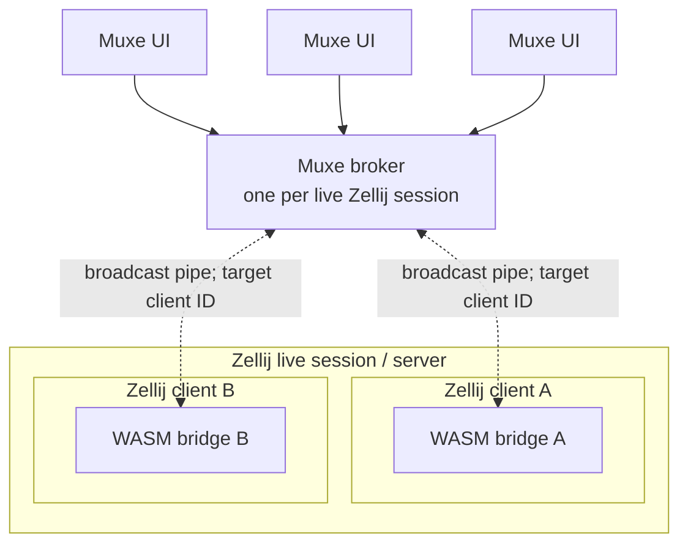
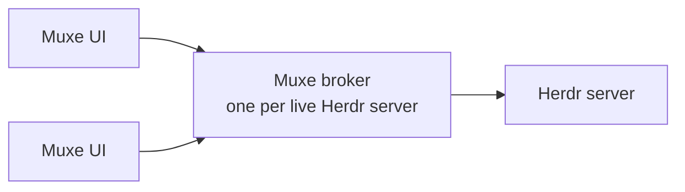

# Muxe Design

> **Status:** Complete design record for Steps 1 through 7. V1 behavior, configuration, architecture, UI, dependencies, verification, installation, and lifecycle are decided.

## Purpose and navigation

Muxe is a which-key-style menu system for terminal multiplexers. The first release must support both Zellij and Herdr while keeping the menu engine independent of either host. This document is the authoritative behavioral and architectural specification for the Rust implementation.

A root hotkey opens a menu. A binding executes an action, opens an inline submenu, or calls another named menu as a submenu. Arbitrary nested key sequences are possible without adding permanent multiplexer modes. The menu appears as a multiline bar, with bottom placement recommended through the host launcher. [Presentation ownership](#presentation-ownership) defines the host-specific placement boundary.

Examples include:

- `t`, then `t`: create a tab.
- `t`, then `r`: rename a tab.
- `t`, then `1`: focus tab 1.
- `t`, then `s`, then `5`: swap the current tab with tab 5.

The seven numbered sections retain the one-to-one record of the accepted design steps:

| Section | Primary content |
| --- | --- |
| [Step 1: Requirements](#step-1-requirements) | Menu navigation, modal replacement, unknown keys, inactivity, action completion |
| [Step 2: Configuration](#step-2-configuration) | Files and merging, menus and bindings, keyboard profiles, actions, execution policy, context, injections, native mappings |
| [Step 3: Architecture](#step-3-architecture) | Runtime and crate ownership, host adapters, IPC, UI sessions, broker lifecycle, Zellij transport and capture, Herdr transport |
| [Step 4: UI/UX](#step-4-uiux) | Layout, paging, status, themes, color schemes, terminal capabilities, focus |
| [Step 5: Rust libraries](#step-5-rust-libraries) | Runtime, development, and code-generation dependencies; configuration and cache paths |
| [Step 6: Implementation and testing](#step-6-implementation-and-testing) | Platforms, fixtures, deterministic tests, parser and wire validation, code generation, compatibility, CI gates |
| [Step 7: Installation and packaging](#step-7-installation-and-packaging) | Release artifacts, installation receipts, launchers and CLI, logs, activation, rollback, recovery, uninstall |

## Terminology

- **Host:** A target terminal multiplexer and its live server, such as Zellij or Herdr.
- **Binding:** A configured key and its label, settings, and result. The result executes an action or opens another menu.
- **Root menu, named menu, and inline submenu:** A root menu is a named menu launched directly. A named menu may be reused as a submenu by `menu:open`. An inline submenu is a `submenu` mapping embedded in a binding.
- **Muxe UI:** The native terminal process that presents a menu, reads menu input, and renders the menu bar.
- **Thin launcher:** A short-lived, non-interactive `muxe menu open` process started by a native Herdr keybinding. It delegates to `muxe pane open` to create a pane running `muxe ui menu` with the requested root and overrides, then exits.
- **UI session:** One Muxe UI's session ID, pinned configuration generation, active menu stack, timer, origin context, and pending-action state.
- **Ready Muxe UI:** A Muxe UI that has finished attach and host capture and is accepting menu input.
- **Menu view:** The immutable compiled snapshot of the visible menu that the broker supplies to a Muxe UI. The UI selects a binding from that snapshot; the broker remains authoritative for action payloads.
- **Broker:** One native process associated with a live host server. It owns configuration, dispatches actions, and coordinates UI sessions.
- **Host adapter:** The broker component that implements host-specific lifecycle, capability, context, and action behavior.
- **Bridge:** A privileged host-side helper used when the broker cannot call the host API directly. In v1, Zellij uses one client-scoped WASM plugin per attached client; Herdr requires no bridge.
- **Modal scope:** A host-defined scope in which v1 permits only one ready Muxe UI. On Zellij, the scope is one client.
- **Candidate configuration:** A newly loaded configuration undergoing validation.
- **Effective configuration:** The accepted result after built-in defaults, the base file, and the active host override file are merged, and then injections are applied.
- **Configuration generation:** An immutable compiled effective configuration retained for open UI sessions.
- **Origin context:** The immutable host state captured when a UI session attaches. Context references resolve from this snapshot.
- **Portable action:** A host-independent action with shared semantics. A **native action** invokes a host-specific API.
- **Awaited action and detached action:** An awaited action keeps its UI session in the pending-action state until it finishes. A detached action applies post-action behavior after dispatch is accepted while the broker continues to own the work.
- **Injection:** An ordered configuration patch that applies defaults or overrides to selected menus.
- **Capture lease:** The broker record that grants a bridge temporary ownership of Zellij Locked-mode capture and guards restoration of the prior mode.
- **Bridge registration ID:** An opaque identifier for one bridge registration. It changes after plugin reload or event-pipe replacement and prevents stale bridge events from being accepted.
- **Request pipe and event pipe:** The two server-wide Zellij CLI channels. The request pipe carries broker requests; the event pipe carries bridge registrations, acknowledgements, results, and health events.
- **Schema fingerprint:** A digest of a wire-message schema and its serialization profile. Peers require an exact match before exchanging archived messages.
- **`wasm_sha256`:** The SHA-256 of the complete packaged or stable WASM bytes. Native code computes and verifies it before installation and activation; receipts, journals, and backup verification retain the actual byte hash.
- **`bridge_build_id`:** A shared deterministic pre-link build identity derived from defined build inputs and metadata. The same value is compiled into the WASM and every native platform build; native target architecture does not affect it. It proves expected build registration and compatibility, not trusted loaded-byte attestation.
- **`$CONFIG_DIR` and `$CACHE_DIR`:** Design placeholders for Muxe's platform-resolved configuration and cache directories. [Configuration and cache directories](#configuration-and-cache-directories) defines their exact paths.

## Step 1: Requirements

### Menus and navigation

- The configuration may define multiple named root menus.
- Named menus are reusable. `menu:open` accepts either a named menu or an inline submenu, never both.
- A named menu called from another menu behaves as a submenu. `menu:return` returns to the caller rather than to a single globally defined parent.
- Inline submenus may define the same fields as named menus, including an optional title, tags, settings, and bindings.
- Menu-reference cycles are configuration errors. Validation rejects direct and indirect recursion after merging and injection.
- Nesting depth is otherwise limited only by the finite, acyclic configuration.
- All v1 root menus occupy a modal scope and are non-sticky. The broker permits at most one ready Muxe UI in each modal scope; on Zellij, the scope is one client.
- Activating another root in the same scope replaces the current Muxe UI before the new one becomes ready. The broker tells the previous Muxe UI to dismiss.
  - The previous UI stops accepting input, applies the `menu:quit` execution policy, and releases its UI session.
  - The requested root then opens with a fresh menu stack.
- Different Zellij clients have independent modal scopes and may use Muxe concurrently.
- Persistent or tab-scoped sticky roots are a future feature. They require their own focus and input-mode policy and do not use the v1 modal-scope policy.
- `menu:return` pops one submenu frame. At a root menu, it quits the UI session.
- `menu:quit` closes the entire menu stack.

### Unknown keys

An unknown key delivered to Muxe is swallowed:

- It is not forwarded to the previously focused pane.
- It does not alter the current menu or submenu stack.
- It resets the menu inactivity timer.

On Zellij, configured Locked-mode host bindings execute before an active Muxe menu receives the key. Those bindings are deliberately reserved to Zellij and are outside the swallow contract. Every key not bound in Locked mode is delivered to Muxe and follows the rules above.

### Menu inactivity timeout

- The default inactivity timeout is 10 seconds.
- `settings.timeout: off` disables it globally.
- Every received key resets it, including an unknown key.
- Expiration quits the entire UI session.
- The inactivity timer pauses while Muxe awaits an asynchronous action.

### Key events

The effective top-level `keyboard` profile determines key identity, Escape disambiguation, and repeat/release handling. [Keyboard input profiles](#keyboard-input-profiles) defines those requirements and their configuration capability checks.

### Action completion

After an action binding succeeds, behavior is configurable:

```text
binding setting > menu setting > global setting > built-in action default
```

The supported `after_action` values are:

- `quit`: close the entire menu stack.
- `return`: return to the parent; at a root, quit.
- `stay`: keep the current menu active.

The global default is `quit`. A menu may override it, and a binding may override its menu.

If an awaited action fails, Muxe stays in the current menu and reports the error. Normal post-action behavior does not run after failure.

A detached action applies post-action behavior after dispatch is accepted. A later failure is written to persistent logs. When the adapter supports it, that failure is also surfaced as a notification, because the originating menu may no longer exist.

[Generic execution policy](#generic-execution-policy) defines awaiting, detachment, cancellation, and the pending-action state. [Zellij active-menu input routing](#zellij-active-menu-input-routing) defines capture and replacement ordering.

## Step 2: Configuration

The YAML configuration expresses the semantic model for menus, bindings, actions, execution, host-native mappings, and host overrides.

### Configuration files

Configuration lives under `$CONFIG_DIR`.

Files:

- `config.yml`: required base configuration.
- `zellij.yml`: optional Zellij override.
- `herdr.yml`: optional Herdr override.

`config.yml` requires `version: 1`. Override files inherit the base version and may not change it.

#### Load and reload order

For one host, effective configuration is built in this order:

1. Seed built-in defaults and built-in injections.
2. Load `config.yml`.
3. Recursively merge the active host override file.
4. Apply the final ordered injection map to every selected menu.
5. Validate the complete effective model, including keys, actions, context references, native capabilities, menu references, and cycles.
6. Atomically replace the effective configuration only if every stage succeeds.

Automatic watching is enabled by default and may be disabled for filesystems where watching is unreliable or expensive.

```yaml
settings:
  reload:
    watch: true
    debounce: 200ms
```

`settings.reload.debounce` defaults to `200ms`. The debounce waits for a complete atomic-save burst before reloading. Users on unusual or remote filesystems may raise it. `config:reload` requests an explicit reload without debounce.

Host-version checking is configured independently from schema and capability validation:

```yaml
settings:
  host:
    version:
      check: min
```

`settings.host.version.check` accepts `min`, `strict`, or `off`:

- `min`, the default, rejects a host older than Muxe's minimum supported version. A newer host than the latest version verified by Muxe is allowed and produces a verbose log warning.
- `strict` rejects hosts older than the minimum or newer than the latest verified version.
- `off` disables version gating, including the minimum-version error.

This setting does not disable protocol, schema, or action-capability checks. Those checks still reject incompatible configured behavior. Additive Herdr schema changes are compatible when they do not change a configured method or parameter schema.

If a watched or explicit reload produces invalid YAML, invalid semantics, or an incompatible native action, Muxe keeps the current effective configuration.

#### Merge rules

- Mappings merge recursively by key.
- Scalars replace inherited scalars.
- Sequences replace inherited sequences as complete values unless a future field explicitly defines different semantics.
- Existing mapping entries retain their position when overridden.
- New base entries append after seeded entries.
- New host-override entries append after base entries.
- Mapping order is semantically significant for binding display and injection application.
- `{ _remove: true }` removes an inherited menu, binding, injection, or optional setting.
- `{ _replace: true }` on a mapping replaces the inherited mapping wholesale: the marker is consumed and the remaining sibling keys become the complete replacement. Sibling keys absent from the replacement are dropped.
- Unknown fields are configuration errors with source spans and suggestions. Native payload fields are validated by the active adapter rather than ignored.

### Menus and bindings

Named menus are a mapping keyed by stable menu ID:

```yaml
menus:
  main:
    title: Muxe
    tags: [root]
    bindings: {}
```

A menu title is optional. An absent title remains absent:

- the Muxe UI does not fall back to the menu ID;
- `title:exact` and `title:regex` selectors do not match it;
- stable targeting remains available through ID selectors for named menus.

Bindings are an ordered mapping keyed by canonical key string:

```yaml
bindings:
  t:
    label: tabs
    action: menu:open tabs
```

Bindings may carry optional CEL `conditions` with `include`, `enable`, and `show` expressions:

```yaml
bindings:
  left:
    label: prev page
    action: menu.page:prev
    conditions:
      include: pages.count > 1
      enable: pages.current > 1
```

All three conditions default to true:

| False condition | Behavior |
| --- | --- |
| `include: false` | Remove the binding before layout. |
| `enable: false` | Keep the binding visible and non-executable; the default theme dims it. |
| `show: false` | Keep the binding executable but hide it from the menu bar. |

The `pages.*` context (`pages.count`, `pages.current`, 1-based) is available only in conditions of pager bindings: bindings whose action is `menu.page:prev` or `menu.page:next`. Referencing `pages.*` from any other binding is a configuration error.

Evaluation is acyclic. Compute the pageable grid and page count without pager bindings first, then evaluate pager conditions against the resulting `pages.*`. [Status and error presentation](#status-and-error-presentation) defines theme control over disabled styling.

Every visible binding requires a non-empty label. A binding with `hidden: true` remains executable, is omitted from the menu bar, and does not require a label.

Menus and bindings may contain nested `settings` maps. Inheritable settings follow global, menu, then binding precedence.

### Keyboard input profiles

Keyboard behavior depends on the effective top-level `keyboard` profile.

- In `vt100` mode, Muxe parses legacy terminal input. Escape uses a short ambiguity timeout, legacy aliases remain indistinguishable, and every received key unit is treated as a press. Hardware repeat cannot be distinguished from deliberate repeated presses.
- In `kitty` mode, disambiguated escape codes are always required. A press triggers a binding. Explicitly encoded repeat events are ignored by default and may be enabled per binding; release events are consumed and never trigger a binding. Legacy repeated bytes that the selected profile cannot label remain indistinguishable presses.
- The `repeat` setting is unavailable when event types are disabled. An explicit repeat policy is not a global inherited default. It makes the binding depend on event-type support, and configuration loading rejects it when the effective profile cannot honor it.
- The parser and internal key representation retain every identity supplied by the effective profile without inventing fields the host did not provide.

Keyboard negotiation is a top-level configuration concern:

```yaml
keyboard:
  mode: vt100
  vt100:
    escape-timeout: 25ms
  kitty:
    event-types: false
    alternate-keys: false
    all-keys-as-escape-codes: false
```

`keyboard.mode` is `vt100` or `kitty` and defaults to `vt100`. That default remains usable when Kitty support is disabled in the multiplexer or outer terminal.

`keyboard.vt100.escape-timeout` defaults to `25ms`. It resolves a standalone Escape byte after waiting for a possible longer control sequence. The duration is configurable for slow or remote links. `off` is invalid because standalone Escape would never resolve deterministically.

In `kitty` mode, disambiguated escape codes, flag `0b1`, are mandatory and not configurable. Optional v1 enhancements are:

| Setting | Kitty flag | Zellij default | Herdr default |
| --- | ---: | ---: | ---: |
| `event-types` | `0b10` | `false` | `true` |
| `alternate-keys` | `0b100` | `false` | `true` |
| `all-keys-as-escape-codes` | `0b1000` | `false` | `false` |

A future adapter defaults an enhancement to `true` only when its complete input path declares support. Associated text, flag `0b10000`, is not requested or configurable in v1.

The adapter defaults are applied while compiling the effective configuration. A user may override them, but enabling a flag the active adapter cannot provide rejects the candidate configuration.

Every canonical binding records the input capabilities required to match it correctly. Configuration loading fails closed when a binding depends on a disabled capability. Dependencies include:

- An explicit `repeat` policy requires event types.
- Repeat and release semantics for text-producing keys and for Enter, Tab, or Backspace also require all-keys-as-escape-codes.
- Alternate or base-layout selectors require alternate keys.
- Modifier-key bindings and lock-modifier matching on text-producing keys require all-keys-as-escape-codes.
- Text-producing keypad identities such as `keypad+1` require all-keys-as-escape-codes. Without that flag they can collapse to ordinary text even when Kitty disambiguation is enabled.

If no binding depends on a disabled enhancement, the reduced profile is valid. Muxe never silently pretends that an unavailable repeat, alternate, lock-modifier, or all-keys-as-escape-codes identity was observed.

#### Host keyboard capability boundary

The Muxe UI selects `vt100` or negotiates the configured Kitty flag set before accepting menu input. It restores the prior terminal mode on every orderly or handled error exit.

Zellij's plugin `Event::Key(KeyWithModifier)` is never authoritative input. At the pinned revision it loses event type, alternate and base-layout keys, associated text, lock modifiers, and keypad distinctions. The Muxe UI therefore reads its terminal pane directly.

Stock Zellij supports only the v1 Kitty baseline used by `keyboard.mode: kitty`. Its outer client requests `CSI > 1 u`, and its pane emulator stores and reports only whether that first enhancement layer is active. The Zellij adapter rejects an effective configuration that enables any of the three optional enhancements. Sending a larger flag set from Muxe cannot upgrade this path.

Pinned Herdr requests flags `1|2|4` from its outer Unix terminal path, and its pane encoder supports event and alternate fields. Its complete outer-to-pane path does not currently prove all-keys-as-escape-codes; the adapter rejects that setting when requested. The table above defines both hosts' defaults.

Configuration validation checks binding capability dependencies against the effective profile. Runtime startup separately verifies that the pane accepted the negotiated mode. Refusal or timeout aborts the Muxe UI rather than degrading after configuration activation. [Kitty keyboard protocol tests](#kitty-keyboard-protocol-tests) defines verification obligations.

### Key syntax

Binding keys and `keyboard:send.keys` use canonical, human-readable strings. Examples include:

- `super+g`
- `ctrl+shift+a`
- `f13`
- `keypad+1`
- `unicode+1f642`
- `esc`
- `backspace`

The grammar defines one canonical modifier order. Input aliases may be accepted, but diagnostics and normalized output use the canonical form.

The normative v1 key registry lives in the `muxe-core` schema and is emitted as generated reference documentation rather than duplicated here. It covers printable Unicode keys, named control and navigation keys, function keys, modifier keys, keypad identities, canonical modifier order, and primary, alternate, and base-layout identities.

Each canonical key records its alternate-keys and all-keys-as-escape-codes requirements. The binding compiler combines those requirements with any explicit repeat policy to derive the event-types requirement. The internal representation preserves every supplied identity without collapsing distinct inputs prematurely. Associated-text matching is out of scope for v1. [Kitty keyboard protocol tests](#kitty-keyboard-protocol-tests) must verify that the generated reference and capability table are exhaustive.

### Action syntax

Actions support two equivalent forms.

#### Internally tagged mapping

```yaml
action:
  type: pane:split
  direction: right
```

#### Compact expression

```yaml
action: pane:split right
```

Compact expression form supports scalar arguments only. Its rules are:

- An action schema explicitly declares which fields may be positional.
- Positional arguments must precede named `field=value` arguments.
- Duplicate named arguments are errors.
- Unquoted tokens use YAML 1.2 core scalar resolution for null, booleans, integers, and floats.
- Quoted tokens are always strings.
- Complex mappings, lists, inline submenus, and structured native values use tagged mapping form.

Example:

```yaml
action: foo:bar abc 123 "quoted value" field=5
```

### Portable action model

Action type names use one of these flat naming forms:

```text
{category}:{verb}
{category}.{subcategory}:{verb}
```

Categories are singular. Examples include:

- `menu:open`
- `menu:return`
- `menu:quit`
- `config:reload`
- `keyboard:send`
- `command:execute`
- `tab:create`
- `pane:split`
- `session:detach`

#### Menu and configuration actions

The first release includes:

- `menu:open`
- `menu:return`
- `menu:quit`
- `menu.page:prev`
- `menu.page:next`
- `config:reload`

`menu:open` accepts either a named `menu` reference or an inline `submenu` mapping, but never both.

#### Keyboard output

`keyboard:send` accepts exactly one of these fields in schema version 1:

- `keys`: an array of canonical semantic keys.
- `text`: a UTF-8 string.

A future `sequence` field will support structured events and timing. Schema version 1 recognizes `sequence` only to produce a targeted unsupported-feature diagnostic. It must not silently ignore, parse without executing, or defer failure until invocation.

Raw terminal escape bytes are not part of the portable action.

#### External commands

`command:execute` is required in the first release. It runs an executable directly without an implicit shell.

```yaml
action:
  type: command:execute
  program: cargo
  args: [test]
  cwd:
    $context: origin.pane.cwd
  env:
    CARGO_TERM_COLOR: always
```

Fields:

- `program`: required executable name or path.
- `args`: optional string array passed after the program.
- `cwd`: optional working directory.
- `env`: optional string-to-string environment map.

There is no separate `argv` field. A user who wants shell evaluation must explicitly select a shell as `program` and provide its arguments.

`command:execute` defaults to detached execution.

#### Portable multiplexer actions

The initial design includes these generalized families where Zellij and Herdr have useful matching semantics:

- **Tabs:** create, close, rename, focus by index or direction, and move or swap by index or direction.
- **Panes:** create or split, close, focus by index or direction, and move or swap where both hosts permit it.
- **Pane presentation:** resize, zoom or fullscreen, floating or embedded state, and pane-frame visibility where portable.
- **Sessions:** create, attach or switch, rename, detach, and quit or kill where both hosts have matching semantics.

Layout actions are not part of the required portable family. Host-specific layout operations remain available through native actions.

The portable layer does not attempt to generalize every multiplexer operation. Host-specific behavior uses a native action or, when appropriate, `keyboard:send`.

### Generic execution policy

Asynchronous execution is a core capability rather than a Herdr-specific option. Each action type reports whether it is:

- awaitable;
- detachable;
- cancellable.

The conceptual capability record is:

```rust
struct ExecutionCapabilities {
    awaitable: bool,
    detachable: bool,
    cancellable: bool,
}
```

Configuration uses inherited execution settings:

```yaml
settings:
  execution:
    mode: await
    timeout: 30s
    on-timeout: detach
    on-menu-control: detach
```

Fields:

- `mode`: `await` or `detach`.
- `timeout`: the maximum time Muxe waits; a duration or `off`.
- `on-timeout`: `detach` or `cancel`.
- `on-menu-control`: behavior when `menu:quit` or `menu:return` interrupts an awaited action; `detach` or `cancel`.

Defaults:

- Generic execution timeout is `off` unless an action or inherited setting changes it.
- `on-timeout` defaults to `detach`.
- `on-menu-control` defaults to `detach`.
- `command:execute` defaults to `mode: detach`.
- Other asynchronous actions declare an action-specific default, normally `await`.

Semantic validation rejects unsupported combinations. For example, `on-timeout: cancel` is invalid when an adapter cannot cancel that action.

Only one action may be pending in one UI session. While it is pending:

- `menu:quit` and `menu:return` remain active and follow `on-menu-control`.
- Other action bindings are swallowed.
- Menu inactivity timing is paused.

A generic execution timeout and a host-native timeout are independent. For example, Herdr may continue waiting after Muxe detaches its local wait.

### Context references

Any scalar action parameter may use a typed context reference:

```yaml
pane-id:
  $context: origin.pane.id
```

Compact actions may use the corresponding token:

```yaml
action: tab:create workspace-id=$origin.workspace.id
```

Context references are type-checked against the action parameter before a configuration becomes active. The resolved concrete value is validated again immediately before dispatch.

The examples use these paths from the closed [context registry](#context-registry-and-missing-values):

- `origin.workspace.id` where the host has workspaces;
- `origin.tab.id`;
- `origin.pane.id`;
- `origin.pane.cwd`.

The following registry defines the supported paths, evolution rules, and missing-value behavior. [Origin context](#origin-context) defines host capture.

#### Context registry and missing values

V1 uses a closed, typed object tree. Dotted paths name nested fields: for example, `origin.host.kind`, `origin.client.id`, `origin.tab.id`, and `origin.pane.cwd`. Configuration loading rejects unknown paths and type mismatches.

The registry is:

| Reference | Type | Availability |
| --- | --- | --- |
| `origin.host.kind` | host-kind enum | Always |
| `origin.server.id` | opaque server ID | Always |
| `origin.client.id` | opaque client ID | When the host exposes clients |
| `origin.session.id` | opaque session ID | When the host exposes sessions |
| `origin.workspace.id` | workspace ID | Workspace-aware hosts |
| `origin.tab.id` | tab ID | When available |
| `origin.tab.index` | non-negative integer | Hosts with positional tabs |
| `origin.pane.id` | pane ID | Pane-originated invocations |
| `origin.pane.type` | pane-type enum | When available |
| `origin.pane.cwd` | absolute path | When the origin pane exposes a working directory |
| `origin.selection.text` | string | When selected text was captured |
| `origin.invocation.source` | invocation-source enum | Always |
| `origin.worktree.id` | worktree ID | Worktree-aware hosts |
| `origin.worktree.path` | absolute path | When a worktree is present |
| `origin.agent.id` | agent ID | Agent-aware hosts |
| `origin.link.url` | URL | Link-triggered invocations |
| `origin.link.handler.id` | link-handler ID | Link-handler invocations |

The registry uses portable entity paths even when a value is initially available from only one adapter. `origin.native.zellij.*` and `origin.native.herdr.*` are reserved for genuinely raw host fields added later; they must not duplicate portable properties.

Adding a new typed reference is an additive, backward-compatible schema evolution for existing configurations. A configuration that starts using the new path naturally requires a Muxe version that knows it; the top-level configuration format version need not change solely because an unused context path was added.

If a known path has no value in a particular origin context, the broker returns `context_unavailable` before dispatch and executes nothing. The Muxe UI remains at its current menu level and applies the existing failure behavior, including resetting the inactivity timer. Muxe never omits the parameter or substitutes a current pane implicitly.

### Injections

Each injection applies reusable defaults or overrides to selected menus.

```yaml
inject:
  My.menu:
    select:
      type: title:exact
      value: my-menu
    action:
      type: override
      bindings: {}
```

Rules:

- `inject` is an ordered mapping keyed by unique injection name.
- `select.type` is required and has no default.
- `action.type` is required and is either `override` or `defaults`.
- `override` recursively patches supplied leaves and honors `_remove`; a patched mapping carrying `_replace: true` is replaced wholesale per the merge rules instead of deep-merged.
- `defaults` recursively fills only absent leaves and does not replace existing values.
- Injections apply in final merged-map order.
- Overriding an existing injection retains its position.

Version 1 selectors are:

- `all`
- `id:exact`
- `id:regex`
- `title:exact`
- `title:regex`
- `tags:contain`

`id:*` applies only to named menus. Inline submenus may be selected through title, tags, or `all`.

#### Built-in injections

The runtime seeds `Builtin.escape` first:

```yaml
inject:
  Builtin.escape:
    select:
      type: all
    action:
      type: override
      bindings:
        esc:
          hidden: true
          action: menu:quit
```

It then seeds `Builtin.backspace`:

```yaml
inject:
  Builtin.backspace:
    select:
      type: all
    action:
      type: override
      bindings:
        backspace:
          hidden: true
          action: menu:return
```

It then seeds `Builtin.pagination` as an `override` so pager keys win over same-key menu bindings:

```yaml
inject:
  Builtin.pagination:
    select:
      type: all
    action:
      type: override
      bindings:
        left:
          hidden: true
          action: menu.page:prev
          conditions:
            include: pages.count > 1
            enable: pages.current > 1
        pgup:
          hidden: true
          action: menu.page:prev
          conditions:
            include: pages.count > 1
            enable: pages.current > 1
        right:
          hidden: true
          action: menu.page:next
          conditions:
            include: pages.count > 1
            enable: pages.current < pages.count
        pgdn:
          hidden: true
          action: menu.page:next
          conditions:
            include: pages.count > 1
            enable: pages.current < pages.count
```

Pager bindings stay out of the grid through `hidden: true`, not through their action type. [Sizing, overflow, and narrow terminals](#sizing-overflow-and-narrow-terminals) defines pager rendering and key selection.

A user may patch or remove any built-in by name:

```yaml
inject:
  Builtin.escape:
    _remove: true
  Builtin.backspace:
    select:
      type: tags:contain
      value: backspace-returns
```

A later injection may remove an injected binding from selected menus:

```yaml
inject:
  My.no-controls:
    select:
      type: tags:contain
      value: no-controls
    action:
      type: override
      bindings:
        esc:
          _remove: true
        backspace:
          _remove: true
```

### Zellij native mappings

Zellij exposes two overlapping native APIs. Muxe keeps them separate.

#### Low-level actions

Namespace:

```text
native.zellij.action:{kebab-case-action-name}
```

Example:

```yaml
menus:
  tabs:
    bindings:
      t:
        action:
          type: native.zellij.action:new-tab
          tab-name: logs
          should-change-focus-to-new-tab: true
          cwd:
            $context: origin.pane.cwd
```

This action API maps to `zellij_utils::input::actions::Action` and dispatches through Zellij's public `run_action(Action, context)` plugin API function.

The dedicated `new_tab(name, cwd)` plugin API function is intentionally not used for this mapping because it constructs the narrower `api.plugin_command.NewTabPayload`. `run_action(Action::NewTab { ... })` reaches the richer `api.action.NewTabPayload`. That payload supports tiled and floating layouts, swap layouts, initial command or plugin panes, focus behavior, working directory, and unblock conditions.

The YAML representation uses lowercase kebab-case for action variants, enum values, and action fields.

`ActionComplete` means that Zellij completed host dispatch; it does not carry a general failure value. The Zellij adapter requires `RunActionsAsUser`.

The adapter uses typed `Action` dispatch. It does not dynamically construct protobuf bytes or call Zellij's private host ABI. [Zellij native code generation](#zellij-native-code-generation) specifies mirror generation, conversion, correlation, and verification.

#### High-level plugin API commands

Namespace:

```text
native.zellij.command:{kebab-case-function}
```

Example:

```yaml
menus:
  tabs:
    bindings:
      l:
        label: open development layout
        action:
          type: native.zellij.command:new-tabs-with-layout
          layout: |
            layout {
              tab name="dev" {
                pane
              }
            }
```

This namespace exposes state-changing user commands from Zellij's public plugin API. It excludes queries, subscriptions, plugin internals, and background integrations. Function and argument names use kebab-case.

The Zellij plugin requests every permission required by the exposed command set, even when the effective configuration references only some of its commands.

[Zellij native code generation](#zellij-native-code-generation) defines generation and verification of the exposed set and typed dispatch code from pinned Zellij sources.

### Herdr native mappings

Herdr native actions use the raw socket API. Muxe does not spawn the Herdr CLI for each configured action.

Method names map reversibly:

```text
pane.resize          <-> native.herdr.pane:resize
plugin.action.invoke <-> native.herdr.plugin.action:invoke
server.reload_config <-> native.herdr.server:reload-config
```

Herdr's snake_case JSON parameter names become kebab-case YAML fields and are converted back before socket dispatch.

Example:

```yaml
keyboard:
  mode: kitty

  kitty:
    event-types: true
    alternate-keys: true
    all-keys-as-escape-codes: false

menus:
  main:
    bindings:
      ctrl+l:
        label: grow pane right
        settings:
          repeat: true
          after_action: stay
        action:
          type: native.herdr.pane:resize
          pane-id:
            $context: origin.pane.id
          direction: right
          amount: 0.1
```

Wire request after context resolution:

```json
{
  "id": "muxe-42",
  "method": "pane.resize",
  "params": {
    "pane_id": "w1:p3",
    "direction": "right",
    "amount": 0.1
  }
}
```

#### Method scope

- Expose every unary request method, including queries and blocking waits.
- Ignore successful response data.
- Preserve Herdr error codes and messages.
- Reject streaming methods such as `events.subscribe`, because an action invocation has no consumer for the event stream.

#### Awaited Herdr methods

A Herdr method's own timeout is independent of Muxe execution settings:

```yaml
bindings:
  w:
    label: wait for pane exit
    action:
      type: native.herdr.events:wait
      match-event:
        event: pane-exited
        pane-id:
          $context: origin.pane.id
      timeout-ms: 120000

    settings:
      execution:
        mode: await
        timeout: 30s
        on-timeout: detach
        on-menu-control: detach
```

`timeout-ms` is a real Herdr `events.wait` field. Herdr may wait for 120 seconds. Muxe waits for 30 seconds, then detaches the adapter-owned request.

Detaching stops menu-level waiting. It does not imply rollback of a mutation already accepted by Herdr.

#### Runtime schema compatibility

At startup or reconnection, the adapter reads `herdr api schema --json` from the exact installed Herdr binary. It checks only the methods and fields used by the effective configuration.

Compatibility checks require:

- the runtime method still exists;
- every configured field still exists;
- every newly required runtime field is supplied;
- literals satisfy runtime types, enums, ranges, patterns, and unions;
- each typed context reference is accepted by the runtime field;
- nested maps and arrays remain compatible.

The fully resolved request is validated again immediately before dispatch.

Compatible runtime drift includes unrelated new methods, new optional fields, and additional response fields. Incompatible drift includes removed methods, newly required omitted fields, changed parameter types, and enum values removed from configured fields.

Unknown schema constructs fail closed with a diagnostic when they affect a configured request. Constructs confined to unused methods do not block unrelated bindings. [Herdr schema generation and compatibility cache](#herdr-schema-generation-and-compatibility-cache) defines schema generation, normalization, validation scope, and cache keys.

#### Incompatibility behavior

- If a config reload introduces an incompatible Herdr action, reject the entire candidate and keep the current effective configuration.
- If the live Herdr server behind the socket changes while the adapter is running, reconnect to the replacement server and revalidate. Keep menus usable, but block only affected bindings through [runtime compatibility state](#runtime-compatibility-state).
- Selecting a blocked binding keeps the menu active and reports its stored compatibility diagnostic.

A compatibility diagnostic includes the YAML source span, method, field, bundled expectation, runtime schema, Herdr version, and protocol.

#### Compatibility cache behavior

Schema compatibility results are cached by normalized schema content and the configured set of native actions. Protocol and schema-version numbers alone are insufficient: Herdr treats protocol mismatches as incompatible, while schema content may change without a new `schema_version` value.

[Herdr schema generation and compatibility cache](#herdr-schema-generation-and-compatibility-cache) defines storage, keys, and integrity rules; [Herdr schema-drift tests](#herdr-schema-drift-tests) defines verification.

### Complete base example

```yaml
version: 1

keyboard:
  mode: vt100

settings:
  timeout: 10s
  after_action: quit

  reload:
    watch: true
    debounce: 200ms

  execution:
    timeout: off
    on-timeout: detach
    on-menu-control: detach

menus:
  main:
    title: Muxe
    tags: [root]

    bindings:
      t:
        label: tabs
        action: menu:open tabs

      p:
        label: panes
        action:
          type: menu:open
          submenu:
            title: Pane actions
            tags: [pane-menu]

            settings:
              after_action: stay

            bindings:
              h:
                label: focus left
                action: pane:focus direction=left

              v:
                label: split right
                action: pane:split direction=right

      c:
        label: run tests
        action:
          type: command:execute
          program: cargo
          args: [test]
          cwd:
            $context: origin.pane.cwd
          env:
            CARGO_TERM_COLOR: always

        settings:
          execution:
            mode: await
            timeout: 2m
            on-timeout: cancel
            on-menu-control: detach

      s:
        label: send interrupt
        action:
          type: keyboard:send
          keys: [ctrl+c]

      i:
        label: insert greeting
        action:
          type: keyboard:send
          text: "hello\n"

      r:
        label: reload configuration
        settings:
          after_action: stay
        action: config:reload

  tabs:
    title: Tabs
    tags: [tabs]

    bindings:
      t:
        label: new tab
        action: tab:create

      r:
        label: rename tab
        action: tab:rename

      "1":
        label: focus tab 1
        action: tab:focus index=1
```

## Step 3: Architecture

### Runtime topology and ownership

Each live multiplexer server has one associated native Muxe broker. The broker is a generic process, not a Herdr-specific daemon. Any number of short-lived Muxe UIs connect to it through one host-independent protocol.

For Zellij, the broker maintains a server-wide identity but does not call the Zellij server API directly. It communicates over a Zellij pipe with the WASM bridge associated with each attached client:



Zellij broadcasts URL-addressed pipe messages to every matching plugin instance. Requests target a client and its active bridge registration; only that registration acts. [Zellij pipe lifetime](#zellij-pipe-lifetime) defines targeting, correlation, and channel ownership.

For Herdr, the broker talks directly to its server socket:



Future CLI operations, SDKs, automation, and agents use this same topology: they connect to the broker rather than learning a multiplexer-specific transport.

#### Runtime ownership

The broker owns:

- configuration loading, YAML parsing, merging, injection, validation, watching, and compiled configuration generations;
- action definitions, context resolution, capability checks, dispatch, completion correlation, and generic execution policy;
- detached child processes and timeout/cancellation enforcement;
- host-adapter state and future server/session-wide Muxe state;
- the authoritative mapping from protocol requests to the active host adapter.

The Muxe UI owns only the active interactive session:

- terminal input parsing, profile negotiation, and terminal mode management;
- the menu stack and inactivity timer;
- rendering a broker-provided menu view;
- sending selected binding IDs and their configuration generation to the broker;
- presenting broker results and errors.

The Muxe UI never invokes a WASM bridge or Herdr socket directly. It knows the broker endpoint and the invocation identity needed by that broker. On Zellij, that identity includes the Zellij client ID; otherwise UI-to-broker messages are host-independent.

The broker supplies an immutable compiled menu-view snapshot for each active Muxe UI. Action payloads remain authoritative in the broker: a Muxe UI selects a binding from the snapshot, and the broker resolves and executes that binding against the named configuration generation.

### Shared implementation and workspace boundaries

Host-independent Rust code owns YAML parsing and source spans, merging and injection, semantic validation, and compiled configuration. It also owns key representation and terminal input parsing, the menu graph and runtime stack, action semantics, execution policies, capability checks, and the rendering model. The crate boundaries below separate the pure terminal parser from `muxe-core`.

Native host configuration and launcher APIs create and customize the terminal pane. Host adapters coordinate attachment, lifecycle, input routing, native actions, context collection, and notifications. The Muxe UI renders within the supplied pane.

The initial Cargo workspace separates terminal input parsing, the Muxe UI, broker, adapter contract, concrete host adapters, and bridge wire schemas:

- `muxe-core`: host-independent configuration model and compiler, key model, menu-view model, active-menu state machine, action semantics, execution policy, and diagnostics. It contains no async runtime, terminal, multiplexer, or IPC dependencies.
- `muxe-terminal-input`: a pure, bounded, incremental parser for terminal input bytes. It owns lossless raw key events and vt100/Kitty sequence semantics, but no configuration matching, async runtime, terminal I/O, rendering, multiplexer, or IPC behavior. It does not depend on another Muxe crate.
- `muxe-protocol`: versioned UI-to-broker wire-message types and framing, plus host-independent bridge envelopes, correlation IDs, lifecycle messages, health and lease messages, and structured bridge errors. It owns common `rkyv` and Serde wire representations but no broker, UI, or adapter behavior.
- `muxe-zellij-protocol`: typed Zellij-specific bridge payloads shared by the native Zellij adapter and the WASM bridge. It depends on the generic envelopes in `muxe-protocol` and contains no native runtime or Zellij transport process.
- `muxe-adapter-api`: the internal async `HostAdapter` contract, adapter capabilities, live-server identity, origin-context exchange, native request/results, health events, and shutdown semantics. It depends on host-independent types from `muxe-core`; it is separate because async host lifecycle and dispatch do not belong in the pure core.
- `muxe-adapter-zellij`: the native broker-side Zellij adapter, including the two CLI-pipe children, client registration and targeting, Locked-mode capture lifecycle, JSON bridge transport, and native-action correlation. It depends on `muxe-adapter-api`, `muxe-protocol`, and `muxe-zellij-protocol`.
- `muxe-adapter-herdr`: the Herdr socket adapter, generated schema and concrete request validation, compatibility cache integration, reconnection when the live server behind the socket changes, and native request correlation. Herdr has no separate bridge process in v1 and therefore needs no Herdr bridge-protocol crate.
- `muxe-ui`: the native terminal UI library. It owns stdin driving, terminal profile negotiation, resize handling, conversion from lossless terminal events to `muxe-core` key candidates, rendering, menu-session orchestration, and the broker client. It depends on `muxe-terminal-input`, `muxe-core`, `muxe-protocol`, and only genuinely shared native utilities; it does not depend on a concrete adapter.
- `muxe-broker`: the host-independent broker service library. It owns configuration file I/O and watching, generation retention, UI sessions, action dispatch, generic process execution, local IPC serving, and one injected `HostAdapter` or adapter factory. It depends on `muxe-core`, `muxe-protocol`, `muxe-native`, and `muxe-adapter-api`, but not on either concrete adapter crate.
- `muxe-native`: a small native-platform utility crate only for code demonstrably shared by at least two of `muxe-ui`, `muxe-broker`, and the concrete adapter crates. Likely candidates are runtime-directory handling, owner-only local transport primitives, process-launch helpers, terminal-safe OS wrappers, and platform error conversion. It must not become a catch-all and must not depend on the UI, broker, or adapter implementations.
- `muxe`: the single installed native executable and composition root. It owns argument parsing and report setup, selects and constructs `muxe-adapter-zellij` or `muxe-adapter-herdr`, injects that adapter into `muxe-broker`, and dispatches Muxe UI or broker mode.
- `muxe-zellij-wasm`: the client-scoped Zellij plugin, depending on `muxe-protocol`, `muxe-zellij-protocol`, and generated Zellij API conversion code but not on any native crate.

The dependency graph remains acyclic:

```text
muxe ─────────────────► muxe-ui
  ├───────────────────► muxe-broker
  ├───────────────────► muxe-adapter-zellij
  └───────────────────► muxe-adapter-herdr

muxe-ui ──────────────► muxe-core
  ├───────────────────► muxe-protocol
  ├───────────────────► muxe-terminal-input
  └───────────────────► muxe-native

muxe-broker ──────────► muxe-core
  ├───────────────────► muxe-protocol
  ├───────────────────► muxe-native
  └───────────────────► muxe-adapter-api

muxe-adapter-zellij ──► muxe-adapter-api
  ├───────────────────► muxe-protocol
  ├───────────────────► muxe-zellij-protocol
  └───────────────────► muxe-native

muxe-adapter-herdr ───► muxe-adapter-api
  └───────────────────► muxe-native

muxe-adapter-api ─────► muxe-core
muxe-zellij-protocol ─► muxe-protocol

muxe-zellij-wasm ─────► muxe-protocol
  └───────────────────► muxe-zellij-protocol
```

Neither `muxe-broker`, `muxe-core`, nor `muxe-adapter-api` depends on a concrete host. The `muxe` composition root is the only crate that selects a concrete adapter. This keeps broker-only tests and builds independent of both host stacks and permits future feature-gated compositions.

Shared code moves into `muxe-native` only after both consumers exist; v1 does not pre-allocate abstractions there.

### Host adapter boundary

One broker instance owns exactly one compiled-in implementation of an internal async Rust `HostAdapter` trait. The boundary covers:

- host and live-server identity;
- modal-scope identity and active-menu capture lifecycle;
- capability reporting;
- server-wide and per-modal-scope health and lifecycle events;
- origin-context capture and enrichment;
- native action dispatch, correlation, and cancellation where supported;
- adapter shutdown.

`muxe-adapter-zellij` and `muxe-adapter-herdr` are the v1 implementations. Future hosts add another adapter crate and rebuild Muxe. V1 deliberately has no dynamic-library ABI or external adapter process protocol.

### Broker IPC

The v1 broker listens on a Unix-domain socket under the current user's runtime directory. The endpoint is owner-only. Its deterministic name hashes the host kind plus `ZELLIJ_SESSION_NAME` for Zellij or the canonical `HERDR_SOCKET_PATH` for Herdr. The connection handshake verifies the live server identity so a stale endpoint cannot impersonate a newly created server with the same discovery key. A future Windows port may use an owner-only named pipe while preserving the same discovery and handshake semantics.

The v1 UI-to-broker protocol uses a four-byte unsigned big-endian payload length followed by one `rkyv` archive. The length excludes the prefix and may not exceed the fixed 8 MiB `MAX_FRAME_LEN`; receivers reject an oversized prefix before allocating its payload. All v1 participants are Rust components built from the same project, so the Muxe UI can retain an aligned archived menu-view snapshot without deserializing it into a second object graph.

The semantic broker API must remain independent of `rkyv`. A later version may negotiate JSON, MessagePack, CBOR, or another codec for non-Rust SDKs and agents without changing broker operations. V1 does not promise that archived bytes are compatible across Muxe versions; peers must identify their protocol version and reject an incompatible connection.

The stream begins with a small endian-stable prelude containing a magic value, protocol version, codec identifier, schema fingerprint, peer role, and the fixed framing limit. Each received payload is placed in an `rkyv::util::AlignedVec` with the archive's required alignment and accessed only through checked `rkyv::access` with `bytecheck`; `access_unchecked` and other unchecked archive access are prohibited. The connection state machine validates the envelope, peer role, message legality, and semantic bounds before mutating broker state.

A malformed prelude, frame, archive, role, schema fingerprint, or message sequence closes only the offending connection. Teardown releases resources owned by that connection through the normal disconnect path. It must not retire another bridge, close another UI, alter another session's pinned generation, or partially apply the rejected message.

#### Broker message flow and compatibility

A persistent connection carries typed, correlated requests and responses plus broker-to-client events. The v1 flow includes:

1. `Hello` / `Welcome`: verify codec, exact schema fingerprint, process version, client role, limits, and live-server identity.
2. `PrepareUiLaunch`: let a thin launcher resolve replacement semantics and obtain an unpredictable pending-launch token before creating a host pane.
3. `RegisterPendingPane`: associate the token with the exact host pane and temporary tab returned by the launcher.
4. `AttachUi`: resolve host bootstrap data and the requested root, capture origin context, and pin a configuration generation. An attachment with a pending-launch token waits for commit before receiving its menu view or becoming ready.
5. `CommitUiLaunch` / `AbortUiLaunch`: release or cancel a gated attachment after host placement succeeds or fails.
6. `InvokeBinding`: name UI session, generation, and binding ID; return an execution ID or a structured pre-dispatch error.
7. `MenuControl`: report quit or return while an action is pending so the broker can apply execution policy.
8. `DetachUi`: release the UI session and its generation reference.

Server events report execution completion, adapter health changes, broker retirement, and fatal errors relevant to the connection. Heartbeats and exact timeout values are implementation details, but loss must be detected in bounded time. V1 does not poll for execution results and does not open a connection per request.

The `rkyv` handshake requires an exact schema fingerprint. Muxe does not claim archived-message compatibility across different fingerprints, even when application versions share a semantic major version. An incompatible new client reports the mismatch and does not remove, replace, or send archived messages to the live old broker. [Activation, upgrade, and rollback](#activation-upgrade-and-rollback) defines cross-version retirement.

#### Generic and host-specific bridge messages

Most bridge message structure is reusable by another multiplexer that requires a privileged plugin or helper process. `muxe-protocol` owns:

- protocol and schema-fingerprint negotiation;
- request, response, and event envelopes;
- bridge-registration, request, UI-session, and execution correlation IDs;
- registration, capability advertisement, health, heartbeat, lease, retirement, and shutdown messages;
- generic input-capture begin/end lifecycle;
- origin-context request/results;
- dispatch acceptance, completion, and structured error shapes.

The common envelope wraps a concrete typed host payload; it does not use an unvalidated `serde_json::Value` escape hatch. `muxe-zellij-protocol` supplies:

- Zellij client, pane, plugin, and session identities;
- broadcast target selection;
- Locked-mode capture state and restoration payloads;
- generated Zellij action requests and `ActionComplete` correlation;
- Zellij-specific compatibility and pipe-failure diagnostics.

The two-CLI-pipe process arrangement, pipe blocking and release, and reconnection are transport behavior in `muxe-adapter-zellij`, not generic message semantics. A future bridged adapter reuses the common envelopes and lifecycle but defines its own typed payload crate only when it has host-specific wire data.

### UI session lifecycle

#### Configuration generation lifetime

An open Muxe UI pins the configuration generation received at invocation. A successful reload becomes current for new Muxe UIs but does not mutate or reset existing menu stacks. The broker retains an older compiled generation while at least one connected Muxe UI references it and releases it after the final reference closes.

Every binding invocation carries the pinned generation and binding ID. The broker resolves both together, so an action can never silently change underneath an open menu after reload.

#### Runtime compatibility state

Runtime host drift does not mutate an immutable configuration generation or create a new one. The broker maintains a separate compatibility state keyed by configuration generation, binding ID, and the active host-schema fingerprint.

After Herdr reconnects to a replacement server, the adapter rebuilds this state atomically. It notifies connected Muxe UIs when binding availability changes. The menu view retains the binding; [Status and error presentation](#status-and-error-presentation) defines its blocked presentation. The broker checks current compatibility again when the binding is selected and returns the stored diagnostic without dispatch if it is blocked.

Configuration reload uses different semantics: a candidate containing an incompatible configured action is rejected in full, so no new configuration generation is activated.

#### Origin context

The host adapter captures one immutable origin context when a Muxe UI attaches, before later focus changes can affect action targets.

- Each Zellij bridge continuously tracks the last focused non-Muxe pane for its associated client. When the Muxe UI attaches through its own pane ID, the target bridge snapshots that prior pane and supplies the client, session, tab, pane, and working-directory values available from Zellij.
- For Herdr, the launcher preserves the native origin environment before creating the UI pane. The UI forwards both the saved origin and its own caller context during `AttachUi`. The Herdr adapter validates the origin identifiers against the live server and enriches the immutable snapshot over the server socket. [Herdr transient-tab trampoline](#herdr-transient-tab-trampoline) defines the exact bootstrap variables and launch sequence.

The broker stores the snapshot with the UI session. Context references resolve from that snapshot even if focus changes while the menu is open.

#### Action concurrency

Each Muxe UI has at most one pending action, as defined by the execution policy. The broker preserves request order within a UI session and assigns every accepted invocation a broker-unique execution ID. Muxe UIs in different modal scopes execute concurrently. A host adapter may serialize only the operations required by its transport or host contract. Zellij serializes transport release on its shared request pipe, but not the asynchronous execution that follows.

[Menus and navigation](#menus-and-navigation) defines the one-ready-UI modal-scope rule. Every active Muxe UI has its own session ID, pinned configuration generation, origin context, menu stack, timer, and pending-action state.

#### Pending UI launch gate

`PrepareUiLaunch` is available only to the launcher peer role. It applies the modal replacement policy before allocating a random 128-bit token and a bounded lease. At most one pending or ready Muxe UI may own one modal scope. A second prepare request resolves the first pending launch through the same abort path before issuing another token.

The launcher passes the token to the new process as `MUXE_PENDING_LAUNCH_TOKEN`. This value coordinates process placement only; root, theme, and color-scheme values remain ordinary `muxe ui menu` arguments. The UI performs `Hello` and `AttachUi` but does not enter raw mode, change terminal modes, render, accept input, or become the authoritative modal owner while the token is pending.

The launcher calls `RegisterPendingPane` immediately after the host returns a pane ID. `AttachUi` also reports the UI's host pane identity, so either message can establish the cleanup target if the other process fails. After successful placement, `CommitUiLaunch` supplies the final pane identity. The broker revalidates the pane and origin, completes the held `AttachUi`, and only then allows terminal setup and rendering.

`AbortUiLaunch`, launcher disconnect, or lease expiry completes the held `AttachUi` with a launch-aborted error. If the UI connection exists, it exits without having entered raw mode. If cleanup needs a host operation, the broker closes only the registered pane after revalidating its identity; it never closes an origin tab based only on stale launch metadata. All cleanup operations are idempotent.

#### Muxe UI disconnect cleanup

An orderly `DetachUi` and an unexpected Muxe UI connection loss both release the UI session, origin snapshot, and configuration-generation reference. If an action is pending, unexpected loss is semantically `menu:quit`: the broker applies the inherited `on-menu-control` policy and either detaches or cancels according to the action capability and configuration. It never substitutes a hard-coded disconnect policy.

#### Focus cleanup

The host adapter owns focus restoration. It first uses the host's native close-and-restore behavior. If the chosen host UI mechanism requires an explicit focus action, the adapter focuses the captured origin only when the exiting Muxe UI's pane still owns focus. It never steals focus after the user has moved elsewhere.

The Muxe UI independently restores all terminal modes it changed on orderly exit, broker disconnect, startup failure, and handled signals or panics. Uncatchable process termination remains outside this guarantee.

### Broker lifecycle and execution ownership

#### Broker startup and host loss

The broker starts on demand, without a systemd, launchd, or other service unit. A launcher or Muxe UI first connects to the deterministic per-host endpoint. If no live broker answers, concurrent starters serialize through an owner-only startup lock associated with that endpoint.

The lock holder rechecks the endpoint, removes a validated stale socket if necessary, and starts broker mode from the same `muxe` executable. It waits for a readiness handshake containing the verified server identity; other starters wait and reconnect. The lock is scoped to one endpoint and startup attempt, not held for the broker lifetime. Stale endpoint and stale lock recovery must verify owner liveness before removal.

The broker remains alive while its associated host connection is healthy, regardless of whether a Muxe UI is currently open. On connection loss it attempts reconnection for a short bounded grace period. If the host is definitively gone, the broker retires: it removes the discovery endpoint, rejects new clients, fails awaited and host-native operations, and discards host state. It continues only as a supervisor for already detached generic child processes until each exits or reaches its timeout, then terminates.

#### Broker crash behavior

If the broker process dies, an attached Muxe UI fails closed: it restores terminal state, reports that the broker disconnected, and exits. It does not replay an action, upload its archived snapshot to a new broker, or pretend that a pending execution has a known result. The next invocation connects to a broker endpoint or spawns a fresh broker.

#### Long-running execution owners

Detached work requires an owner after the visible menu closes. The broker is that owner for every host that uses this topology.

- `command:execute` runs in the broker under [Generic process supervision](#generic-process-supervision).
- Zellij-native actions are dispatched through the target client's WASM bridge. The broker owns request correlation; `ActionComplete` still means Zellij finished dispatching the action, not that an arbitrary resulting operation succeeded.
- Herdr-native requests are dispatched by the broker over the server socket.
- A future adapter can reuse the broker execution contract and add only its host transport and context and action implementation.

#### Native-request delivery

State-changing native requests use at-most-once dispatch. The adapter retries only when it can prove that no request bytes reached the host. If a non-idempotent request may have reached Zellij or Herdr and its response is lost, the execution completes with `outcome_unknown`; Muxe never replays it.

Read-only queries may retry after reconnect. A state-changing action may also be explicitly classified as idempotent, such as focusing tab 1 or a tab with a fixed name. Such an action is retryable only while it is the most recently posted action for that host. After Muxe posts a later action to the host, replaying the earlier action may no longer preserve the intended order or result.

#### Generic process supervision

The broker directly owns generic child process groups and guarantees configured cancellation, timeout enforcement, and reaping for the broker's lifetime. V1 does not launch a separate supervisor per command. If the broker itself crashes, supervision is lost; the attached Muxe UI reports the broker failure and Muxe does not claim that cross-platform timeout enforcement survives the crash.

### Zellij host integration

#### Zellij process scope

There is one broker per running, attachable Zellij session/server and one WASM bridge per attached Zellij client. A Zellij session here is the live boundary that survives client detach and reattach, not a serialized exited session restored through session resurrection.

Each bridge determines and registers its client identity with the broker. A Muxe UI identifies its own terminal pane, and the broker resolves that pane to the unique client-scoped bridge through the bootstrap protocol defined below; pipe delivery is never assumed to be single-recipient.

Muxe currently has no broker or bridge state that needs resurrection. Restoring an exited Zellij session creates a fresh broker and fresh bridges, reloads configuration, and starts with no active or detached Muxe work. Persisting Muxe state through Zellij session resurrection is out of scope unless a later requirement identifies state worth restoring.

#### Zellij pipe lifetime

The Zellij broker owns one shared pair of persistent `zellij pipe` children for the lifetime of its server association. The pair is server-wide, not per client:

- The request pipe carries broker-to-bridge JSON lines and has exactly one global in-flight transport request. Every bridge receives the broadcast message, but only the active registration named by the target acts and releases the request pipe.
- The event pipe carries one initial subscription and deliberately remains blocked. Bridges use its CLI pipe ID for registrations, transport acknowledgements, replies, adapter events, and asynchronous action completions.

A single opaque `bridge_registration_id` replaces separate bridge-instance and registration-epoch fields. A bridge generates a fresh unpredictable 128-bit registration ID whenever it registers on a new event channel, including after plugin reload or event-pipe replacement.

The broker maintains one active registration per Zellij client and targets `(client_id, bridge_registration_id)`. Zellij's plugin ID remains diagnostic host data, not a Muxe identity. Late events from an inactive registration are rejected.

Accepting a new registration for a client atomically supersedes its previous active registration. The broker sends a best-effort retirement notice to the displaced bridge, but correctness depends only on the active ID check; continuing heartbeats or late events from the displaced registration cannot reactivate it.

The adapter owns explicit channel state machines:

- request: `starting`, `idle`, `in-flight`, or `restarting`;
- event: `starting`, `awaiting-registrations`, `ready`, or `restarting`.

Every request and event carries the protocol version, request ID, relevant bridge registration ID, and channel generation. A target bridge validates the request, requests that Zellij unblock the request pipe, and then emits a distinct `RequestReleased` transport acknowledgement on the event pipe. That acknowledgement is not action success. Dispatch acceptance and final completion are separate events. The broker does not write the next request until it receives the matching release acknowledgement.

The broker establishes a readable event pipe and a current target registration before dispatch. It keeps a bounded FIFO per client and schedules clients round-robin onto the single request pipe. This preserves per-client order and prevents a busy client or automation caller from starving another. Action execution may overlap after dispatch because completions use the event pipe.

A release deadline protects the global queue. If the request pipe exits or does not release in time, the broker kills and replaces only that child. A state-changing request whose line may have reached the target becomes `outcome_unknown` and is not replayed. Late acknowledgements whose request or channel generation no longer matches are ignored.

Event-pipe health and bridge-registration health are separate. Each active `(client_id, bridge_registration_id)` owns a heartbeat lease renewed by that registration's events. If one lease expires, the broker invalidates only that registration, pauses that client's request queue, and reports that client adapter as unavailable. Healthy clients on the same event pipe continue. A whole-pipe restart occurs only when the event child exits, framing becomes invalid, writes can no longer be observed, or every registration loses channel-level contact.

On a whole-pipe failure, the broker pauses all new Zellij requests, replaces the subscription, invalidates the old registrations, and waits for fresh registrations before resuming each client. Event decoding uses single-line bounded JSON frames; stdout is drained continuously, stderr is handled separately, and non-protocol or oversized output makes the channel unhealthy rather than growing an unbounded buffer.

This split is required by pinned Zellij's CLI pipe state machine: while a pipe is blocked it can receive server output but cannot consume another stdin request; after it is unblocked it can read another request but cannot deliver asynchronous output while waiting in `stdin.read_line`.

The request/event pair is sufficient for multiple attached clients. Per-client pipe processes are deferred unless measurement shows that the bounded global dispatch queue is a bottleneck.

Zellij pipe names and payloads are strings, so both channels use versioned JSON control messages rather than wrapping archived bytes in base64. Shared wire-message types derive both `rkyv` and Serde representations where their semantics overlap. Pipe traffic is low-volume control data; readability and native/wasm32 compatibility outweigh a second binary encoding on this boundary.

#### Zellij client bootstrap

Each client-scoped WASM bridge requests Zellij's client list, selects the entry marked `is_current_client`, and registers its client ID, current pane ID, and fresh bridge registration ID on the event pipe. A new Muxe UI sends its inherited `ZELLIJ_PANE_ID` in the broker attach request. The broker resolves that pane through the active registrations and returns the unique client ID that the Muxe UI uses for subsequent targeted requests.

Bootstrap waits for a fresh active registration when the mapping is not yet available. It must fail rather than guess if no unique client owns the pane.

#### Zellij active-menu input routing

Pinned Zellij resolves the reduced `KeyWithModifier` against the current host mode before an unbound key becomes `Action::Write` and carries its raw bytes to the focused PTY. `intercept_key_presses()` runs later in the `WriteCharacter` path and cannot suppress a matching host binding.

Muxe therefore uses Zellij's existing Locked mode without modifying its bindings:

1. The client-scoped bridge snapshots the client's current input mode before the root Muxe UI becomes ready.
2. The bridge requests `InputMode::Locked`.
3. The Muxe UI waits for a `ModeUpdate` confirming Locked mode before it accepts menu input.
4. Keys that have no Locked-mode binding become raw `Action::Write` input for the focused Muxe PTY and are consumed by the menu.
5. Existing Locked-mode bindings remain active and execute as Zellij actions. They may intentionally resize the Muxe pane or perform other host operations; they do not become Muxe bindings.
6. On normal menu exit, focus loss, or Muxe UI disconnect, the bridge closes the menu and restores the captured original mode only if the client remains in Locked mode and the current capture lease still owns that mode.
7. If the bridge observes a mode change away from Locked while the menu is active, it treats the new mode as user-owned state: it dismisses the menu and releases capture without restoring the older snapshot.

The bridge maintains a short capture lease so broker failure conditionally restores the original mode when the client is still in Muxe-owned Locked mode. The broker also retains the captured mode and can ask a reloaded bridge to perform the same guarded restoration. If every Muxe component fails simultaneously, the client can remain in Locked mode, but its original Locked bindings—including any normal unlock binding—remain intact; no user keymap was mutated.

V1 does not temporarily clear or rewrite Locked-mode bindings. A future opt-in exclusive-capture feature may investigate that behavior, but it requires a separate transaction and recovery design. The accepted v1 limitation is that a key bound by Zellij in Locked mode is unavailable to the active Muxe menu.

The broker models Zellij modal capture as a serialized single-owner state machine, not a reference count. It stores one record per client containing the current UI session, capture lease, and original Zellij mode.

When another root is activated for the same client, the replacement Muxe UI remains not ready while the broker dismisses the old Muxe UI and waits for its detach acknowledgement or bounded cleanup deadline. V1 always completes the old capture transaction first.

If the client is still in Muxe-owned Locked mode, the bridge restores the captured original mode; if the mode already changed externally, it preserves that newer mode. After release is confirmed, the replacement snapshots the resulting current mode and enters its own Locked-mode capture.

This remains correct when the host keybinding has already opened and focused the replacement pane before the broker learns the replacement intent. There may be a brief release-then-recapture transition, but no two Muxe UIs are ready and no capture leases overlap. A lease transfer without that transition is deferred unless a future broker-initiated launcher can provide replacement intent before focus moves.

Persistent or sticky Muxe UIs are outside v1, as specified in [Menus and navigation](#menus-and-navigation). A future sticky session may lose focus without closing. It cannot assume modal Locked mode or unconditional restoration after a user-driven mode change; lock behavior must be separately configurable and designed with that lifecycle.

### Herdr host integration

#### Herdr process scope

There is one broker per live Herdr server, keyed by its socket path. All Muxe menu panes connected to that server share it. When the Herdr server is gone, [Broker startup and host loss](#broker-startup-and-host-loss) defines the reconnection grace period, retirement, and any remaining detached-child supervision.

Herdr startup hooks are one-shot initialization commands rather than supervised daemons. Muxe therefore uses the on-demand startup protocol in [Broker startup and host loss](#broker-startup-and-host-loss).

Herdr serves one initial non-streaming request per Unix-socket connection and closes the connection after its response. The Herdr adapter therefore opens a fresh connection for every ordinary request, validates exactly one correlated response, and treats trailing data as a protocol error. Event subscriptions use their own long-lived connection after the initial `events.subscribe` request; no ordinary request is multiplexed onto that stream.

The adapter uses the generic socket API directly and requires no bridge. [Herdr installation](#herdr-installation) defines the native installation model; [Herdr transient-tab trampoline](#herdr-transient-tab-trampoline) defines command-pane creation and cleanup.

## Step 4: UI/UX

### Presentation ownership

The host creates, focuses, and removes the terminal pane in which a Muxe UI runs. The Muxe UI renders within the supplied dimensions and does not create, reposition, or resize its own pane.

Zellij root bindings run the Muxe UI directly through the native `Run` action. Herdr root bindings start the thin `muxe menu open` launcher, which uses the [Herdr transient-tab trampoline](#herdr-transient-tab-trampoline). Placement options are limited to each host's launcher API. Bottom placement is recommended, not a cross-host invariant; [Root launcher examples](#root-launcher-examples) provides both hosts' recipes.

### Menu layout and content

Each menu renders a title plus breadcrumb line followed by a responsive grid of key cells. V1 has no separate hint line; explanatory text belongs in binding labels.

Row 1 is `title: breadcrumb-tail`. The breadcrumb shows the path from the root to the current menu. When width is insufficient, truncate from the left and keep the tail, since later crumbs carry more context. Use Unicode ellipsis `…` for truncation.

Binding cells render as `key label` pairs in configuration order. Cells fill column-major: top-to-bottom, then the next column.

The UI selects the largest column count for which every cell fits the available width under the padding and `max-item-title-length` constraints. The search tries candidate column counts from widest down. Given the items, column count, and rows, the arrangement is deterministic; no further arrangement search is needed.

Labels and titles are single-line layout atoms: cut at the first newline and strip Unicode control code points before measuring. Multiline content never participates in grid geometry.

Layout settings are configurable globally and per menu, with menu overriding global:

```yaml
layout:
  padding:
    left: 1
    right: 1
    top: 0
    bottom: 0
    between-rows: 0
    between-columns: 3
  max-item-title-length: 24
```

The example shows the defaults: left/right 1 cell, top/bottom 0 rows, between-rows 0, between-columns 3, and `max-item-title-length` 24.

Labels longer than the limit are truncated with `…`. Keys are never truncated. If a single key cell cannot fit, the grid falls back to one column and allows horizontal clipping only as a last resort.

### Status and error presentation

V1 uses a dedicated bottom status line below the binding grid. The grid stays visible during async work. The status line shows one state at a time, in this precedence order:

1. Fatal errors (`level: error`).
2. Pending-action progress (`level: pending`).
3. Blocked-binding diagnostics (`level: blocked`).
4. Reload notes (`level: reload`).
5. Flashes and idle content (`level: notice`).

The status template's `level` is one of `error`, `pending`, `blocked`, `reload`, or `notice`. Unknown-key flashes and the inactivity countdown do not take over the grid.

Themes control disabled and blocked presentation. Templates branch on per-binding `disabled` and `blocked` state to insert markers and prefixes. The `style()` helper, for example `{{ key | style("dimmed") }}`, applies visual styling only and never inserts markers itself.

The default theme:

- dims disabled bindings;
- prefixes blocked bindings with `!`;
- parenthesizes an unavailable pager direction, as in `(left) · 1/5 · right ▶`.

Selecting a blocked binding displays its stored compatibility diagnostic in the status line. Nerd-font themes may substitute glyphs such as `nf-cod-warning`. A theme may signal state through color alone; the renderer enforces no marker.

Error states remain until the next keypress or menu change. Transient flashes, such as unknown keys, clear on the next key.

### Sizing, overflow, and narrow terminals

V1 grows vertically up to the supplied pane height, then paginates the binding grid. Muxe never scrolls host pane content. Title, breadcrumb, and status lines stay pinned while pages change.

For narrow terminals, reduce the column count first, then truncate labels, then paginate.

On terminal resize, repaginate the grid and reset to the first page. When height is scarce, omit the pager row for a single-page menu. If title plus status plus pager leave zero grid rows, render title plus status only.

Pager bindings are ordinary hidden bindings. The pager row uses theme-controlled `pagination.full` and `pagination.short` templates. Both receive:

- `pages.current` and `pages.count`;
- `prev_key` and `next_key`: the first key defined for each page action in mapping order;
- `prev_keys` and `next_keys`: the corresponding key lists.

The UI selects `pagination.short` when the full template does not fit the available width. The default full template centers `page N/M` between the dimmed pager keys:

```text
◀ left · 2/5 · right ▶
```

Narrow fallback: `‹2/5›`. The `page N/M` indicator lives in the pager row so status-line precedence never displaces it.

Compute height without a pager row first. If the grid fits, the menu has one page and the pager row is omitted, leaving that line available for cells. Otherwise, reserve one line for the pager row and paginate the grid in the remaining height. This calculation requires no fixed-point iteration.

[Built-in injections](#built-in-injections) defines `Builtin.pagination` key precedence and how to patch or remove it by name.

Page navigation follows [Menu inactivity timeout](#menu-inactivity-timeout) and [Generic execution policy](#generic-execution-policy): it resets the timer, but pager keys are swallowed while an action is pending. Only `menu:quit` and `menu:return` remain active under `on-menu-control`.

### Themes, color schemes, and accessibility

V1 provides a host-inherit `default` theme and a `default` color scheme. Built-ins are embedded in the executable. User files are:

- `$CONFIG_DIR/themes/<name>.yml`;
- `$CONFIG_DIR/color-schemes/<name>.yml`.

Top-level `theme:` and `color-scheme:` select these independently; both default to `default`. Any theme may pair with any scheme, but Muxe validates the pairing. `--theme` and `--color-scheme` on every `muxe ui` subcommand and on `muxe menu open` override the configured names for that invocation.

An unknown theme or scheme name, an unresolvable palette reference, or a theme style path missing from the selected scheme is a configuration error. A failed candidate never activates; reload keeps the current effective configuration.

#### Color-scheme schema

Color-scheme example:

```yaml
title: dracula
palette:
  background: "#282a36"
  foreground: "#f8f8f2"
  yellow: "#f1fa8c"
  red: "#ff5555"
  muted: "#6272a4"
colors:
  base:
    text: foreground
    background: background
    muted: muted
  menu:
    hotkey: yellow
    separator: muted
    alert: red
  status:
    error: red
```

Palette values are `#rgb` or `#rrggbb`. Semantic aliases reference palette entries or other aliases; unresolvable references are load errors.

#### Theme schema and style resolution

Theme files group styles and templates into a `common` section plus one section per UI component (`menu` in v1, with other panes possible later). An optional theme-owned `settings` mapping provides finer control:

```yaml
common:
  styles:
    default:
      foreground: base.text
      background: base.background
    muted:
      foreground: base.muted
menu:
  styles:
    title:
      foreground: base.text
      bold: true
    hotkey:
      foreground: menu.hotkey
      bold: true
    alert:
      foreground: status.error
      bold: true
    arrow:
      foreground: menu.separator
    disabled:
      foreground: base.muted
      dim: true
    crumb:
      foreground: menu.separator
    error:
      foreground: status.error
      bold: true
  templates:
    cell: "[alert]! [/alert][disabled]{{ key | rpad(6, ' ') }} → {{ title }}[/disabled][hotkey]{{ key | rpad(6, ' ') }}[/hotkey] [arrow]→[/arrow] [title]{{ title }}[/title]"
    breadcrumbs: "[crumb]{{ c }}[/crumb] › "
    pagination:
      full: "[muted]◀ {{ prev_key }} · {{ pages.current }}/{{ pages.count }} · {{ next_key }} ▶[/muted]"
      short: "[muted]‹{{ pages.current }}/{{ pages.count }}›[/muted]"
    status: "[error]{{ message }}[/error]{{ message }}"
```

Style names resolve in the component section first, with `common` as fallback. Menu templates can therefore use short names while future panes have their own namespace.

Literal style tags must resolve in the rendering section; unknown literal tags are load errors. Dynamic tag names are exempt from load-time checking. They resolve at render time, where an unknown name renders its inner text unstyled.

The `settings` mapping belongs to the theme namespace. Unknown settings keys are ignored for forward compatibility. This is an exception to the configuration rule that unknown fields are errors.

Style properties form a closed set: `foreground` and `background` (scheme paths or `#hex`) plus boolean `bold`, `dim`, `italic`, `underline`, and `strikethrough`. Unknown properties are load errors.

#### Template execution and failure handling

Each template renders independently in an environment without a filesystem loader. `extends`, `include`, and `import` fail. Undefined variables and filters are strict errors.

Plain variables are escaped for `[`, `]`, and Unicode control code points so binding labels and keys cannot inject or break markup. The `style()` filter returns already-safe markup exempt from escaping.

Rendered output is capped at 64 KiB per component; overflow is a render error. On a render error, that component falls back to unstyled plain text and reports through the status line.

Template contexts are:

| Template | Available values |
| --- | --- |
| Cell | `key`, `title`, `disabled`, `blocked` |
| Breadcrumbs | `crumbs` |
| `pagination.full`, `pagination.short` | `pages.current`, `pages.count`, `prev_key`, `next_key`, `prev_keys`, `next_keys` |
| Status | `level`, `message` |

Breadcrumb left-truncation remains renderer-driven. The renderer re-renders with a shortened crumb tail until the visible width fits.

Built-in filters are:

- `rpad(width[, pad])` and `lpad(width[, pad])`: truncate and display-width pad on the right and left, respectively;
- `ellipsis(max)`: truncate with `…`;
- `style(name)`: apply the named style.

Other minijinja builtins remain available except loader-backed tags.

#### Terminal capabilities and accessibility limits

V1 targets truecolor with Unicode symbols. It provides no `NO_COLOR`, color-depth-degrade, or ASCII-fallback paths. Because themes control disabled and blocked markers, constrained terminals may lose state distinctions conveyed only by color or font glyphs.

### Focus presentation

V1 always focuses the menu pane on open. On exit, the host adapter restores focus to the captured origin only when the exiting menu pane still owns focus, under [Focus cleanup](#focus-cleanup). No-focus opens are out of scope.

## Step 5: Rust libraries

### Dependency policy

All versions are managed once in the workspace root and inherited by member crates. Code-generation dependencies live in dedicated tool members and must not enter runtime binaries. No `build.rs` is expected: `mise` tasks produce checked-in generated code, so no build-dependencies are recorded.

Exact feature flags and version pins are resolved in the workspace manifest. They must preserve the capability and crate-boundary contracts below.

### Configuration and cache directories

`$CONFIG_DIR` resolves to `$XDG_CONFIG_HOME/muxe`, falling back to `~/.config/muxe`. `$CACHE_DIR` resolves to `$XDG_CACHE_HOME/muxe`, falling back to `~/.cache/muxe`.

Linux and macOS use these XDG locations. On macOS, Muxe forces them instead of `~/Library` application support and caches. These paths are the v1 contract; exact `platform-dirs` constructor wiring is an implementation detail.

A future Windows port should use `%APPDATA%/muxe` and `%LOCALAPPDATA%/muxe/cache` unless the `XDG_*` variables are set. These Windows paths are not part of v1.

### Runtime dependencies

- `serde` with derive, `serde-saphyr` for YAML 1.2 parsing, `serde_json` for Herdr socket protocol and validation, and `rkyv` with checked `bytecheck` access for UI-to-broker wire messages.
- `thiserror` for machine-readable errors.
- `eyre` for human-facing errors, with `color_eyre::install()` used for report setup while application code uses the `eyre` namespace.
- `thiserror` plus `ariadne` for YAML syntax and semantic configuration diagnostics.
- `tracing` plus `tracing-subscriber` for broker and UI diagnostics.
- `itertools` when it makes advanced iteration clearer than imperative loops. Do not add it for trivial iteration.
- `platform-dirs` for resolving `$CONFIG_DIR` and `$CACHE_DIR`. On macOS, configure it to use XDG directories rather than native macOS directories.
- `crossterm` for terminal raw-mode management, terminal-control commands, and ratatui's output backend. Muxe does not consume crossterm key events because their single key-code field loses Kitty alternate identities. `muxe-terminal-input` parses stdin bytes directly.
- `minijinja` for theme template rendering, without filesystem loader access.
- `ratatui` with the crossterm backend for menu rendering. Layout, pager, and status rows are Muxe-owned widgets; ANSI styling resolves theme styles through the closed modifier set, never free-form attributes. Widget tests use the bundled `TestBackend`.
- `unicode-width` for display-width measurement in layout packing and padding filters; align its version with ratatui's internal copy.
- `tokio` for the broker async runtime: Unix-socket IPC serving, child-process supervision, timeouts, and file watching integration, plus `tokio-util` for length-delimited framing. UI-to-broker messages stay length-framed `rkyv` under [Broker IPC](#broker-ipc).
- `nix` on Unix for child process-group supervision: `tokio` kills the direct child only and timeout combinators kill nothing, so cancelling shell-wrapped commands without orphaning grandchildren requires `killpg`-style group semantics the design already promises. A future Windows port would need equivalent process-tree ownership through Job Objects.
- `notify` with debounced handling for configuration watching, honoring the reload debounce setting; `regex` for title and tag selectors.
- `clap` with derive for the complete native hierarchy: `menu open`, `pane open`, `init`, `integration install zellij`, `integration uninstall zellij`, `activate`, `broker retire`, `compatibility`, `purge`, and the internal broker and UI process modes.
- `kdl` with its default `span` support and the `v1` feature for Zellij `config.kdl` inspection and editing. Muxe calls the explicit KDL v1 parser rather than format fallback, retains the parsed formatting, uses spans for narrow edits, and reparses the complete candidate before replacement.
- `cel` (the parser-plus-interpreter facade, no optional features) for binding `conditions`: parse once at configuration load for diagnostics, evaluate per render against the typed `pages.*` context. `cel-interpreter` alone is insufficient — it carries no parser, which would split one job across two crates.
- `rand` plus `data-encoding` for invocation and registration IDs: 16 bytes from the operating-system CSPRNG rendered as nopad base32 (26 characters). Randomness is injected behind a narrow ID-source interface so tests can use deterministic bytes. No `uuid`: worse readability with no randomness benefit here.
- `sha2` for the SHA-256 Herdr schema and compatibility-cache keys specified in Step 6; `data-encoding` also renders these digests without another encoding crate.
- `zellij-tile` from the exact Zellij repository revision recorded in the [Zellij pin manifest](#zellij-native-code-generation). The WASM dependency and every parsed Zellij source file move in lockstep under that pin-update policy.

### Development dependencies

These dependencies never ship in runtime binaries.

- `insta` for snapshot testing render output and diagnostics, `proptest` for parser and layout-packing properties, `rstest` for fixtures and table-driven tests, `tempfile` for configuration file tests.
- `trycmd` as the primary CLI harness, including Markdown-driven cases for the Step 7 copyable snippets; `assert_cmd` with `snapbox` remain available when a test needs programmatic control over dynamic output.
- `divan` for packing and render benchmarks: attribute-based, low-overhead, CI-friendly, and CodSpeed's recommended path via `codspeed-divan-compat`. `criterion` remains the fallback if deep statistical HTML reporting proves necessary.
- `testty` for full-PTY end-to-end tests. It supplies the real PTY, vt100-backed location-aware terminal frame, input driving, and basic text/style/color/region assertions; Muxe may build project-specific synchronization, semantic assertions, and failure artifacts on those primitives. Widget and ordinary integration coverage defaults to ratatui's bundled `TestBackend`. `ratatui-testlib` and raw-stream `expectrl` are not selected.

### Code-generation dependencies

These developer-time dependencies produce checked-in output.

- `syn`, `quote`, `proc-macro2`, and `prettyplease` for parsing pinned Zellij Rust sources, constructing generated Rust, and formatting checked-in output.
- `typify` plus its required `schemars` model for generating committed Rust request types from the pinned Herdr JSON Schema; `serde_json` loads the schema. These are codegen-tool dependencies only. Runtime validation stays a separate `serde_json` subset validator against the live schema; Muxe does not emit JSON Schema.

## Step 6: Implementation and testing

### Supported platforms and fixtures

V1 supports Linux and macOS. A future Windows port remains possible, and platform-neutral interfaces must not prevent it. That port may replace Unix sockets and process groups with Windows-native equivalents. It will require a modern ANSI-capable terminal; Muxe will not add a ConPTY-specific backend or support older Windows 10 terminal behavior.

Tests use checked-in, minimized fixtures for pinned Zellij source, Herdr schemas, Muxe configuration, protocol messages, ANSI streams, and host context. Deterministic mutations of those fixtures cover valid extensions, incompatible changes, malformed input, and parser edge cases. Tests that run installed multiplexer versions supplement these fixtures; they do not replace them.

### Implementation guidance and compatibility testing

The implementation orchestrator chooses task order and parallelism. The design does not impose sequential phases. Prefer to stabilize shared interfaces before finishing the host adapters; when adapter work is ordered, implement Herdr before Zellij because Herdr is simpler and more urgent.

Muxe records a minimum supported version and a latest verified version for each host. Compatibility expectations follow the host's published version contract:

- For a stable `1.x` host, patch and minor releases within the major line may be presumed compatible until evidence says otherwise.
- For a pre-`1.0` host, a new minor version is a potential breaking boundary. Only patch releases within the same minor line receive that presumption.

Zellij is pre-`1.0`, so every new Zellij minor requires explicit regeneration and compatibility review. The test matrix may prove compatibility across broader versions, and a breaking release may affect only part of the action set.

Runtime handling outside the verified range follows `settings.host.version.check`. Live schema and capability validation remains authoritative for configured behavior. [Compatibility metadata](#compatibility-metadata) records the v1 host versions.

Continuous integration uses three levels:

1. Every change runs deterministic unit, property, snapshot, fixture, code-generation, and fake-adapter conformance tests.
2. Each pull request runs a small real-host smoke suite on Linux against the newest verified Zellij and Herdr versions.
3. Scheduled and release workflows run the full minimum/latest host matrix on Linux and macOS.

One parameterized adapter-contract suite runs against the fake, Herdr, and Zellij adapter implementations without launching a multiplexer. It verifies shared discovery, server identity, capability reporting, context capture, request validation, dispatch correlation, completion and error normalization, reconnection, and lifecycle semantics using recorded host messages. Separate adapter tests cover only host-specific behavior, including Herdr schema/socket handling and Zellij pipes, bridge registration, and capture leases.

### Failure control and parallel-test isolation

Production implementations enter through narrow constructor-injected interfaces at nondeterministic system boundaries. These include the existing `HostAdapter`, host transport, process spawning and child control, exceptional configuration I/O and watcher behavior, and ID generation. Tests use small handwritten fakes with scripted results. Normal configuration-file tests use real files in temporary directories; Muxe does not build a general virtual filesystem or adopt a mocking framework.

Tokio timers use Tokio's test-util virtual time. Each virtual-time test owns its own current-thread runtime, so pausing or advancing time cannot affect another test. Pure state machines accept the current instant or elapsed duration as an input instead of reading a global clock. A general `Clock` trait is added only if implementation reveals a non-Tokio consumer that cannot use this model.

Parallel tests must not mutate the process working directory, environment, signal handlers, terminal mode, or another process-global resource. Paths and environment values are passed explicitly. Each test owns a unique temporary directory, socket path, broker identity, and PTY child. Tests synchronize through observable events or explicit barriers, not sleeps. If an unavoidable process-global test remains, it belongs in a named serial test binary and must document why process isolation is impossible.

Failure scenarios include:

- file read/write/rename and watcher failures;
- malformed, partial, coalesced, oversized, late, and disconnected host transport;
- stale server identity;
- spawn and signal failures;
- child hangs and cancellation;
- cache corruption;
- partial terminal setup or restoration.

Each scenario asserts both the reported error and the required state cleanup.

`loom` is conditional rather than a default dependency. Prefer single-owner state machines and message passing. If an implementation introduces correctness-critical shared locks or atomics for capture leases, UI replacement, or configuration publication, isolate that transition logic and model-check it with `loom`; otherwise, ordinary deterministic Tokio tests cover it.

### UI-to-broker frame validation tests

Framing tests cover every truncation boundary in the prelude, length prefix, and representative archives; declared lengths shorter or longer than the payload; unaligned source slices; invalid archive offsets, lengths, discriminants, and UTF-8; oversized lengths before payload allocation; wrong peer roles; illegal role-specific messages; schema-fingerprint and protocol-version mismatches; trailing data; and multiple coalesced frames. Valid frames copied from every source alignment must remain valid after placement in aligned storage.

`proptest` feeds arbitrary bytes and frame sequences through the same production decoder and persists minimized regressions. It asserts bounded allocation, no panic or unchecked access, deterministic rejection, and progress or connection closure rather than an infinite wait on malformed complete input. Valid archive generation and checked-in malformed archives provide structurally deep seeds and deterministic corpus coverage.

Coverage-guided fuzzing is deferred. The parser and frame decoder remain pure callable boundaries so a fuzz target can be added without changing production behavior. Selecting a fuzz engine must also define its compiler requirements; no nightly compiler or second Rust toolchain is implied by v1.

Every rejection test snapshots broker state before and after the frame. Only the offending connection and resources it exclusively owns may change through normal teardown. Concurrent valid UI and bridge connections must continue, and no rejected message may publish a configuration generation, invoke an action, transfer a capture lease, or mutate a UI session.

### Terminal input parser

`muxe-terminal-input` implements the streaming input parser in its own workspace crate. The parser accepts byte chunks and explicit end-of-input or pending-Escape flushes. It has no I/O, clock, Tokio, crossterm, ratatui, host-adapter, configuration, or `muxe-core` dependency. `muxe-ui` owns stdin readiness, Escape deadlines, resize signals, and terminal setup and passes bytes or flush events into the parser.

CSI parameters use checked `u32` accumulation. Values never saturate: overflow, an invalid Unicode scalar, too many parameters, or an overlong sequence produces a bounded malformed-input result and resets at a defined recovery boundary. Fixed limits prevent untrusted terminal input from growing buffers without bound.

A lossless raw key event stores the primary Unicode or functional key, optional shifted key, optional base-layout key, modifiers, event kind, and applicable lock/keypad state as separate fields. The parser consumes the optional associated-text field correctly to preserve framing, but v1 neither requests it nor exposes it to binding matching. It also handles the legacy key sequences required by the vt100 profile. Unknown well-formed keys remain distinguishable from malformed input so the UI can apply the existing unknown-key policy.

The UI converts a raw key event into ordered `muxe-core` binding candidates without discarding any reported key identity. This conversion, not the parser, applies configuration capability rules and host-specific defensive normalization. Crossterm remains responsible only for raw mode, terminal-control output, and the ratatui backend; its event reader is never active.

### Kitty keyboard protocol tests

The suite must test `vt100` Escape disambiguation, profile-dependent aliases, Kitty negotiation and restoration, configuration capability failures, and every supported press, repeat, release, and alternate-key path. Host-specific coverage includes Zellij's restriction to Kitty flag `0b1` and Herdr's `1|2|4` path.

The key registry generates an exhaustive table for the finite named, control, function, media, modifier, and keypad key identities across their valid event types and capability requirements. Finite modifier masks are exhaustive for those identities. The suite covers press, repeat, release, alternate-key reporting, all-keys-as-escape-codes, and the host-specific profiles: Zellij flag `0b1` and Herdr flags `1|2|4`.

Curated byte fixtures cover Kitty negotiation, profile responses, restoration, fragmented and coalesced reads, unknown sequences, and every documented Zellij or Herdr deviation used by Muxe's defensive normalization. Vt100 Escape tests use virtual time and place read boundaries immediately before, at, and after the disambiguation deadline. They distinguish a lone Escape from an Alt-prefixed key without relying on wall-clock sleeps.

Property tests generate valid Unicode scalar values, modifier masks, alternate-key combinations, event types, chunk boundaries, and malformed byte streams. They verify that arbitrary input never panics and normalization is idempotent.

Boundary and regression cases include:

- ASCII transitions;
- `U+D7FF` and surrogate rejection across `U+D800..U+DFFF`;
- `U+E000`, `U+FFFF`, `U+10000`, and `U+10FFFF`;
- values above the Unicode limit;
- checked numeric overflow beyond `u32`.

Chunk-boundary invariance holds only when byte-arrival timestamps and deadline advancement are identical and the parser is compared after the same flush or end-of-input condition. Tests vary arrival timing separately: vt100 Escape disambiguation intentionally depends on whether the continuation arrives before its deadline.

Generated checks require every configurable canonical key to declare its protocol and host capability requirements. Full-PTY and real-host tests cover negotiation and restoration. Parser correctness does not depend on terminal-emulator support for the complete Kitty protocol.

### Zellij native code generation

A deterministic Rust AST walker parses pinned Zellij sources.

One checked-in Zellij pin manifest records the exact repository commit, corresponding host version, `zellij-tile` source, and inputs consumed by generation. The workspace dependency, source fixtures, generated action mirrors, converter code, dispatch code, policy manifest, and real-host test image must agree with that pin. A validation task fails if any component names a different revision. Automated dependency updates must not advance `zellij-tile` independently.

Every pin change must:

1. fetch or refresh source only from the new recorded revision;
2. regenerate all checked-in Zellij-derived code and metadata;
3. classify every added, removed, or changed public plugin function and action variant;
4. fail on missing converters, unsupported types, or unclassified API changes;
5. compile the WASM bridge and native adapter against the regenerated API;
6. run conversion, adapter-contract, Kitty-path, and matching real-host tests;
7. receive human review of the pin, generated diff, compatibility result, and any minimum/latest-verified version change.

The latest verified Zellij version advances only after these checks pass. Under the default `host.version.check: min`, a newer unverified runtime remains allowed with the previously defined verbose warning; `strict` rejects it.

- Use `syn` rather than tree-sitter.
- Generate serde-friendly Muxe mirror types for Zellij actions and dependent types.
- Match every plugin API argument and return type against an explicit converter registry.
- Convert raw mirrors into validated Muxe types through source-aware `TryFrom` implementations.
- Convert validated Muxe types into upstream Zellij types through infallible `From` implementations.
- Generate config variants, validation metadata, and dispatch arms.
- Correlate `ActionComplete` events with Muxe-generated context IDs.
- Maintain an exhaustive checked-in policy that classifies every discovered public plugin API function as exposed, internal, query, or unsupported.
- Fail generation when a public plugin API function is unclassified.
- Report every unsupported type and function rather than silently omitting drift.
- Embed the pinned source revision or hash in generated output.
- Commit generated Rust so normal builds remain offline and deterministic.
- Do not dynamically construct protobuf messages or call Zellij's private host ABI at runtime.

Mechanical mirror and converter implementation may be delegated to a restricted `cheap-flash-lite` agent. Agent output is not authoritative. Deterministic regeneration, compilation, completeness checks, and conversion tests are the acceptance boundary.

### Herdr schema generation and compatibility cache

A `mise` task generates committed Rust request types and method metadata from a pinned Herdr JSON Schema.

The compatibility validator implements the JSON Schema subset emitted by Herdr. Unsupported constructs fail closed when they affect a configured request; incompatible or unsupported constructs confined to unused methods do not block unrelated bindings. The fully resolved request is validated again immediately before dispatch.

Use two caches under `$CACHE_DIR`.

Normalized runtime schema cache key:

```text
protocol
schema_version
SHA-256(canonical request schema)
validator format version
```

Configured-request comparison cache key:

```text
bundled schema hash
runtime schema hash
normalized configured native-request hash
context-type registry version
validator format version
```

The normalized native-request hash includes methods, supplied fields, constraint-relevant literal values, and typed context references. Cache entries are written atomically, and corruption causes recomputation. The adapter pings the running Herdr server and requires its protocol to match the runtime schema before dispatch.

### Herdr schema-drift tests

Schema-drift tests start from the checked-in pinned schema and apply one deterministic mutation per case.

Accepted mutations include new methods, new optional properties, and new enum alternatives. Incompatible changes to an unused method do not block configured methods. Rejected mutations include removing or renaming a configured method or supplied property, adding a required parameter, changing a supplied value's type, narrowing a bound past a configured literal, removing a configured enum value, changing a referenced context type incompatibly, and changing the protocol incompatibly.

Generator tests require the pinned schema to reproduce the checked-in Rust and method metadata byte-for-byte. Cache tests cover every key component, atomic replacement, truncated or corrupt entries, validator-format changes, and schema changes that retain the same Herdr `schema_version`. A dispatch race test changes the live schema after configuration load and verifies that immediate pre-dispatch validation prevents an incompatible request.

### Activation verification

The permanent test suite uses independently versioned old and target fixtures. It interrupts the coordinator after every journal write, listener transition, bridge swap, per-session reload response, bridge registration, readiness report, and commit/abort message. Each activation unit must converge to the complete old stack or complete target stack. Tests also cover a changed configuration schema, unrecognized bridge bytes, permission denial, multi-client bridge timeout, one failing session in a shared Zellij group, a late session with no broker, non-cancellable work, detached-child supervision, coordinator death, target-broker death, rollback reload failure, stale journals, same-user credential checks, and independent outcomes across Herdr units.

The live release matrix performs upgrade and rollback between the preceding and target Muxe releases on Zellij 0.46.0 and Herdr 0.8.2. Zellij coverage uses at least two simultaneous sessions sharing the stable bridge path, with at least two attached clients in one session. It verifies that a failure in the final session restores the old bridge and every old broker, and that success installs and verifies the target WASM bytes against the target `wasm_sha256` and every fresh registration reports the target `bridge_build_id` without restarting a session. Herdr coverage verifies that the event subscription moves to the target broker without restarting the server.

### Toolchain and validation gates

`mise` pins the only Rust toolchain used for development, CI, and releases. Muxe does not promise a minimum supported Rust version: this is an installed CLI/TUI application rather than a reusable Rust library, and the pinned compiler may be updated often.

Every pull request must pass the deterministic validation task:

- `rustfmt` check;
- workspace compilation, tests, and doctests on the pinned toolchain;
- Clippy with warnings denied, the `pedantic` group enabled, and selected useful `nursery` lints enabled individually;
- byte-clean code-generation checks and fixture validation;
- the small Linux real-host smoke suite defined above.

Enable Clippy's `allow_attributes` and `allow_attributes_without_reason` restriction lints. Prefer `#[expect(..., reason = "...")]` for a local false positive or deliberate exception; an unfulfilled expectation must fail under warnings-as-errors. Any rare broader suppression, including one emitted into generated code, must state its concrete reason beside the suppression. Do not enable the complete `nursery` group or retain a noisy lint merely to claim a larger lint set.

Divan/CodSpeed comparisons are published for pull requests but do not initially fail the build. After stable runners establish baselines, maintainers may set a separate justified regression threshold for an individual benchmark. There is no blanket percentage threshold. Release smoke tests retain coarse timeouts to detect hangs; those timeouts are not latency benchmarks.

### Project task automation

Project toolchains, code generation, dependency setup, and developer tasks use `mise` as the project entrypoint. Generated Zellij and Herdr sources are regenerated and verified through `mise` tasks.

## Step 7: Installation and packaging

### Release and installation model

V1 is distributed through GitHub Releases. The README must show direct archive installation and the mise GitHub backend form:

```text
mise use -g github:boazy/muxe
```

Release tags use `v{major}.{minor}.{patch}`. Asset names use `muxe-v{version}-{os}-{arch}.tar.gz`, where `{os}-{arch}` is one of:

- `linux-x64`;
- `linux-arm64`;
- `macos-x64`;
- `macos-arm64`.

These names allow mise's platform autodetection without a custom asset pattern. Linux archives target musl for static distribution. If either Linux architecture cannot pass the host integration matrix with musl, the release is blocked and the target decision is reopened. A differently linked artifact must not be silently published under the same name.

Each target archive is a complete installation containing:

```text
muxe
lib/muxe/muxe-zellij.wasm
share/muxe/completions/
LICENSE
```

The same platform-independent WASM bytes appear in every archive and must have the same recorded `wasm_sha256`. The native binary locates packaged assets relative to its executable's installation root. Installation instructions must preserve the extracted layout; copying only `muxe` is not a complete Zellij installation.

Every release also publishes `SHA256SUMS` covering all target archives and GitHub artifact attestations covering each archive. The README documents both `sha256sum -c` or `shasum -a 256 -c` verification and GitHub CLI attestation verification. Release automation treats a missing checksum or attestation as a failed release, not as an optional post-release step.

Bash, Zsh, and Fish completion files are generated from the `clap` command definition by a release-only workspace tool, committed, and included under `share/muxe/completions/` in every archive. A mise task regenerates them; CI runs the same generator and fails on any byte-for-byte diff. Completion-generation dependencies are confined to the developer tool and are not linked into the installed `muxe` executable.

`muxe init` creates the required `$CONFIG_DIR/config.yml` starter file and companion theme and color-scheme directories. The starter configuration is embedded in the native binary so initialization does not depend on locating a share directory. The command fails without changing anything when `config.yml` already exists; package installation never creates, replaces, merges, or deletes user configuration.

### Zellij bridge installation

`muxe integration install zellij` manages the stable bridge through the owner-only [Zellij integration receipt](#zellij-integration-receipt). A destination that matches the receipt's recorded `wasm_sha256` is eligible for replacement through the normal activation path. Unrecognized bytes or a receipt mismatch are never overwritten: the command reports both `wasm_sha256` values and requires the user to resolve the file before retrying.

The command copies the archive's `lib/muxe/muxe-zellij.wasm` to `$CONFIG_DIR/integrations/zellij/muxe-zellij.wasm`. It verifies the packaged `wasm_sha256`, writes a sibling temporary file through owner-only creation, and atomically installs the stable bridge.

#### Zellij integration receipt

The command stores `$CONFIG_DIR/integrations/zellij/receipt.json` with mode `0600`. Its versioned schema records:

- the canonical stable bridge path, installed Muxe version, `wasm_sha256`, bridge compatibility record, and optional `.previous` `wasm_sha256`;
- each canonical Zellij config path inspected by the installer;
- whether the installer created, updated, or merely observed the `plugins.muxe` node and the `load_plugins.muxe` child;
- the installed semantic representation and exact text digest of each touched node;
- for an updated pre-existing node, the exact previous node text and semantic representation needed for restoration.

The receipt contains no complete Zellij configuration, Muxe configuration values, environment values, or action payloads. Previous node text is retained only for a node the user explicitly allowed Muxe to replace.

Installation writes an owner-only transaction journal before changing the bridge, KDL document, or receipt. A retry completes or rolls back an interrupted transaction before starting another. The receipt is committed only after the bridge and accepted KDL edits are durable. Initial installation records a correct pre-existing KDL node as `observed`; Muxe never later claims ownership of that node.

An upgrade trusts the existing bridge only when its bytes match the receipt's installed `wasm_sha256` and canonical path. After a successful activation, the receipt atomically advances to the target version and `wasm_sha256` while preserving KDL ownership records. This rule lets a new Muxe binary recognize a legitimate bridge from an older release without embedding every historical byte hash.

Uninstall removes a node created by Muxe only when its current semantic representation and exact text digest still match the receipt. It restores an updated pre-existing node only under the same unchanged check. It leaves observed nodes and user-modified nodes untouched and reports them. The receipt remains until every managed artifact is removed or every unresolved record is explicitly left to the user.

#### Zellij configuration edits and consent

After materializing the bridge, the command inspects the selected Zellij `config.kdl`. It uses `--zellij-config` when supplied. Otherwise, it uses `$ZELLIJ_CONFIG_DIR/config.kdl` when that environment value exists, then falls back to the standard Zellij config path. If the `muxe` plugin alias or its `load_plugins` entry is absent or points elsewhere, an interactive terminal asks whether to add or correct only these nodes:

```kdl
plugins {
    muxe location="file:/absolute/path/to/muxe-zellij.wasm"
}

load_plugins {
    muxe
}
```

The command parses the original document, applies span-based edits that preserve unrelated bytes and comments, parses the complete candidate again, verifies that the file did not change concurrently, preserves its permissions, and replaces it atomically. A malformed document, ambiguous duplicate `muxe` nodes, concurrent modification, or failed candidate parse aborts the configuration edit and prints the required snippet; the installed WASM remains available. If no config exists, an accepted prompt or explicit configure flag creates a minimal document containing these blocks.

`-q` and `--quiet` suppress prompts and normal output. Configuration policy is:

| Invocation | `config.kdl` behavior |
| --- | --- |
| Interactive, without a policy flag | Ask whether to add or correct the managed nodes. |
| Quiet, without a policy flag | Materialize the bridge without editing configuration. |
| Non-interactive, without a policy flag | Behave as `--never-configure`; absence of a prompt is never consent. |
| `--always-configure` | Skip the prompt and apply the safe edit. |
| `--never-configure` | Skip the prompt and never edit. |

The two policy flags are mutually exclusive. With `--quiet --always-configure`, the explicit configure policy wins and output remains quiet. `--quiet --never-configure` is a silent materialization-only operation.

Package installation and `muxe init` do not materialize the bridge or edit Zellij configuration. Herdr-only users therefore receive no unused integration state. `muxe integration install zellij` performs the initial materialization; later upgrades and rollbacks refresh the stable bridge through the activation transaction below without prompting or editing `config.kdl`.

### Herdr installation

V1 installs Muxe as the native `muxe` executable, not as a Herdr manifest plugin. Users install the GitHub release through mise or a direct archive, then run `muxe init`. Muxe has no `muxe integration install herdr` command because Herdr requires no bridge or registered entrypoint.

Herdr's raw socket request envelope does not require a caller plugin ID. Muxe uses generic methods: `layout.apply` requires a layout root, `pane.move` requires a pane ID and destination, and `notification.show` requires a title. A `plugin_id` and manifest entrypoint are required only by plugin-specific methods such as `plugin.pane.open`, which Muxe does not use.

If a configured `native.herdr` action intentionally calls a plugin-specific Herdr method, that action must supply the target plugin's ID and other method parameters through the normal generated schema. The ID identifies the target Herdr plugin; it does not register Muxe as one.

The user adds one `[[keys.command]]` block per root hotkey to the Herdr configuration. Herdr resolves that file from `HERDR_CONFIG_PATH` when set and otherwise uses `~/.config/herdr/config.toml` on Linux and macOS. The command uses `type = "shell"` and invokes `muxe menu open {root}`, as shown under Root launcher examples. The `muxe` executable must be on the environment path inherited by the Herdr server.

After editing the file, the user runs `herdr server reload-config`. Herdr supplies `HERDR_SOCKET_PATH` and the active origin values to the detached launcher. The launcher starts the on-demand broker and uses the [Herdr transient-tab trampoline](#herdr-transient-tab-trampoline). There is no `herdr plugin install`, repository checkout, manifest, or Herdr-owned Muxe update step.

Muxe never edits `config.toml`. Uninstall instructions therefore tell users to remove the root `[[keys.command]]` blocks manually if they no longer want them.

### Launcher contracts

Root launchers are not part of the Muxe YAML schema. Root hotkeys remain in native Zellij or Herdr configuration; Muxe does not generate, rewrite, or own either host's key configuration.

#### CLI interface

```text
muxe menu open [--host auto|zellij|herdr] [--theme {name}] [--color-scheme {name}] {root}
  [--pane-type split|overlay|popup]
  [--parent-pane {id}|current]
  [--direction down|up|left|right]
  [--width {n}|{percentage}%] [--height {n}|{percentage}%]
  [--position {x},{y}]
muxe pane open [--host auto|zellij|herdr]
  [--pane-type split|overlay|popup]
  [--parent-pane {id}|current]
  [--direction down|up|left|right]
  [--width {n}|{percentage}%] [--height {n}|{percentage}%]
  [--position {x},{y}]
  [--no-focus] [--cwd {path}]
  -- {command} [args...]
muxe init
muxe integration install zellij [-q|--quiet]
  [--always-configure|--never-configure] [--zellij-config {path}]
muxe integration uninstall zellij [-q|--quiet]
  [--always-configure|--never-configure] [--zellij-config {path}]
muxe activate [--host all|current|zellij|herdr]
muxe broker retire [--host all|current|zellij|herdr]
muxe compatibility [--json]
muxe purge [--config] [--cache] [--yes]
muxe ui menu [--theme {name}] [--color-scheme {name}] {root}
```

`muxe menu open` accepts and forwards all `muxe pane open` placement options except `--no-focus`. It rejects `--no-focus` because a modal menu must receive keys and [Focus presentation](#focus-presentation) requires focus on open. Generic `muxe pane open` accepts `--no-focus`.

`muxe menu open` does not accept `--cwd`. It always derives the menu process working directory from the captured origin context. Callers that need an explicit working directory use generic `muxe pane open --cwd {path} -- muxe ui menu ...`.

Placement defaults and units are:

| Option | Default or interpretation |
| --- | --- |
| `--host` | `auto`, detected from inherited environment (`ZELLIJ_*`, `HERDR_*`) |
| `--parent-pane` | `current`, meaning the origin pane from context |
| `--pane-type` | `split` |
| `--direction` | `down` |
| `--width`, `--height` | Terminal cells or percentages of the containing terminal area |
| `--position` | Cells from the top-left; applies only to floating or overlay panes |

Any flag combination that the host and pane type cannot honor fails before pane creation. This includes Herdr popup or overlay command panes.

#### Zellij root launchers

A Zellij root keybinding uses the native `Run` action to start `muxe ui menu {root}` directly. The host-created `Run` pane contains the UI. Native Zellij hotkeys bypass `muxe menu open` so they do not create a second pane from inside that pane.

`muxe menu open <root>` remains a muxer-agnostic CLI for manual, scripted, and Herdr flows. On any host it may close or replace the existing menu in scope and then create the UI pane through the host API. [Menus and navigation](#menus-and-navigation) and [Zellij active-menu input routing](#zellij-active-menu-input-routing) remain authoritative for replacement.

Zellij `MessagePlugin` is a keybindable alternative, but is not selected for v1. It maps to `Action::KeybindPipe` with `name`, optional `payload`, a target plugin alias or URL, and `launch_new`. Routing preserves the originating client ID.

A binding could target the Muxe bridge alias and encode the root in `payload`, allowing the bridge and broker to serialize close plus open before a UI pane exists. However, existing-instance targeting versus `launch_new`, per-client bridge identity, and responsibility for pane creation and placement have not been verified for that path. V1 uses direct `Run`.

#### Herdr transient-tab trampoline

A Herdr root binding starts `muxe menu open {root}` through a detached `type = "shell"` custom command. Root, theme override, and color-scheme override remain ordinary launcher arguments.

`muxe menu open` delegates to `muxe pane open` with the structured command argv `muxe ui menu [--theme {name}] [--color-scheme {name}] {root}`. Herdr 0.8.2 cannot create a split with structured argv, so `muxe pane open` uses this verified transient-tab trampoline:

1. Before creating a pane, the launcher connects to the broker and sends `PrepareUiLaunch`. After modal replacement completes, the broker returns the pending-launch token from [Pending UI launch gate](#pending-ui-launch-gate).
2. The launcher sends `layout.apply` with `focus: false` to create a one-pane temporary tab in the origin workspace. The command receives the exact argv, working directory, origin bootstrap environment, and `MUXE_PENDING_LAUNCH_TOKEN`.
3. The launcher calls `RegisterPendingPane` with the returned tab and pane IDs.
4. The launcher sends `pane.move` with the requested target, split direction, ratio, and focus. Moving the temporary tab's only pane closes that tab.
5. After verifying the move result, the launcher sends `CommitUiLaunch` with the final pane identity. The waiting UI receives its `AttachUi` response, enters raw mode, and renders only after commit.

Each Herdr operation uses a fresh socket connection under the [one-request-per-connection contract](#herdr-host-integration). The trampoline uses Herdr's generic socket API directly, with the native installation model in [Herdr installation](#herdr-installation).

The `MUXE_HERDR_ORIGIN_*` bootstrap environment and launch token are:

- `MUXE_HERDR_ORIGIN_WORKSPACE_ID`;
- `MUXE_HERDR_ORIGIN_TAB_ID`;
- `MUXE_HERDR_ORIGIN_PANE_ID`;
- optional `MUXE_HERDR_ORIGIN_PANE_CWD`;
- `MUXE_PENDING_LAUNCH_TOKEN`.

The token coordinates launch; it is not an alternate source for Muxe UI arguments. The broker validates the origin values before constructing portable `origin.*` context.

A direct invocation from a managed Herdr pane uses its `HERDR_WORKSPACE_ID`, `HERDR_TAB_ID`, `HERDR_PANE_ID`, and current working directory as source values. A detached native keybinding uses `HERDR_ACTIVE_*`. The newly created pane receives its own normal `HERDR_*` caller context; [Origin context](#origin-context) defines capture during `AttachUi`.

Launch failures have distinct cleanup targets:

- If `layout.apply` fails, abort the token without creating a pane.
- If `pane.move` fails or returns `changed: false`, send `AbortUiLaunch` and close only the temporary tab returned by this launcher's `layout.apply`. Never close the origin tab or pane.
- If the launcher disappears, the pending-launch lease aborts the waiting UI and closes only its registered pane after identity validation.

[Pending UI launch gate](#pending-ui-launch-gate) defines gated attachment, lease expiry, and idempotent cleanup. [Herdr launcher failure reporting](#herdr-launcher-failure-reporting) defines logging and notifications when no terminal is observable.

V1 Herdr command-pane creation supports `--pane-type split` only. `pane.move` supports right and down splits; `muxe pane open` and `muxe menu open` reject left, up, popup, or overlay placement for Herdr before creating anything. This restriction does not affect Zellij's `Run` behavior.

#### Root launcher examples

The README documents both supported Zellij pane forms. The recommended form is a borderless floating pane across the bottom:

```kdl
keybinds {
    shared_among "normal" "locked" {
        bind "Alt m" {
            Run "muxe" "ui" "menu" "main" {
                floating true
                x "0"
                y "70%"
                width "100%"
                height "30%"
                borderless true
                close_on_exit true
                start_suspended false
            }
        }
    }
}
```

Users who want the menu to participate in the tiled layout use a downward split:

```kdl
keybinds {
    shared_among "normal" "locked" {
        bind "Alt m" {
            Run "muxe" "ui" "menu" "main" {
                direction "Down"
                close_on_exit true
                start_suspended false
            }
        }
    }
}
```

Pinned Zellij accepts `x`, `y`, `width`, and `height` only for the floating `Run` branch. A tiled `Run` ignores those fields and uses the host's initial split size.

Both examples bind the root in Normal and Locked modes so it remains available while another Muxe menu owns Locked-mode capture. The binding is intentionally reserved to Zellij and cannot also be a Muxe menu key. Users merge the `shared_among` child into an existing `keybinds` block and choose an otherwise unused key.

Zellij must inherit a `PATH` containing the mise shim for `muxe`. The installation guide includes `command -v muxe` from a Zellij pane as the check.

The Herdr example uses the verified trampoline through the thin launcher:

```toml
[[keys.command]]
key = "prefix+m"
type = "shell"
command = "muxe menu open --pane-type split --direction down --height 30% main"
description = "Open Muxe"
```

The menu ID and overrides in a Herdr `command` are shell text owned by the user because Herdr's native keybinding format exposes one command string. The README uses the simple `main` ID and shows POSIX quoting for any value containing whitespace or shell metacharacters. The inner `muxe ui menu` process still receives structured argv through `layout.apply`; the trampoline never reuses this shell command string.

### Compatibility metadata

The first release declares Zellij 0.46.0 and Herdr 0.8.2 as both the minimum-supported and latest-verified versions. Those are the versions represented by the pinned Zellij source and Herdr schema/trampoline verification. Lowering a minimum requires adding every newly covered host release to the backward-compatibility matrix; advancing a latest-verified version requires the regeneration and real-host checks defined in Step 6.

One typed compatibility record is compiled into the native binary. It contains:

- Muxe version and target triple;
- UI-to-broker protocol and schema fingerprints;
- minimum and latest-verified host versions;
- pinned Zellij source revision, generated-action fingerprint, `wasm_sha256`, and `bridge_build_id`;
- Herdr protocol version, schema version, normalized schema digest, and verified API feature set.

The native `wasm_sha256` is the SHA-256 of the complete packaged or stable WASM bytes. At installation and activation, native code computes the candidate file's SHA-256 and compares it with the trusted expected producer digest embedded in the native binary. For an existing or rollback bridge, it compares the computed hash with the recorded `wasm_sha256` in the receipt or journal. It never derives both the actual and expected values from the candidate input. Receipts, journals, and backup verification retain the actual byte hash.

The pinned Zellij API does not expose loaded WASM bytes or their digest. Embedding the SHA-256 of the final artifact into that artifact would create a self-reference. The design therefore never embeds the final file hash in WASM or treats `bridge_build_id` as a full-artifact digest.

During registration, the WASM bridge embeds and reports the Muxe version, pinned Zellij source revision, generated-action fingerprint, `bridge_build_id`, and UI-to-broker/bridge protocol and schema fingerprints. The native compatibility record supplies the expected values for every native platform build, and runtime handshakes compare them. Semantic versions alone are insufficient. `bridge_build_id` is a shared deterministic pre-link identity derived from defined build inputs and metadata. The same value is compiled into the WASM and every native platform build; native target architecture does not affect it. It proves expected registration and compatibility, not trusted loaded-byte attestation.

`muxe compatibility` prints a human-readable form. `muxe compatibility --json` emits the complete native record with stable snake_case field names. There is no packaged compatibility file that can be separated from or drift away from the executable. The existing `settings.host.version.check` policy consumes the embedded host ranges. Protocol, schema, `wasm_sha256`, `bridge_build_id`, and capability checks remain mandatory even when version gating is `off`. Native full-byte SHA-256 verification remains mandatory; no host measurement or fallback substitutes for it.

### Persistent logs

Native Muxe processes write JSON Lines to `$CACHE_DIR/logs/muxe.jsonl`. The directory `$CACHE_DIR/logs/` is owner-only and every file is mode `0600`.

Writers coordinate rotation with an owner-only adjacent lock. They rotate before an append would exceed 1 MiB and retain the current file plus `muxe.jsonl.1` through `muxe.jsonl.4`.

Short-lived launchers append and flush synchronously before exit. The broker may buffer ordinary diagnostics but synchronously flushes errors and shutdown records.

Rotation or sink initialization failure falls back to stderr and a host notification when available. It causes operations that require an auditable failure path to fail closed.

Logs include identifiers, versions, fingerprints, bounded diagnostics, and state transitions needed for support. They never include resolved command arguments, injected environment values, terminal input, configuration scalar values, or native-action payloads.

#### Herdr launcher failure reporting

A detached Herdr `type = "shell"` command has no observable terminal. Stderr is diagnostic only and does not guarantee failure reporting. The persistent logging contract above applies to every native Muxe process, including failures before broker startup.

Launcher records contain timestamp, process version, host, operation, request ID when assigned, Herdr error code, and a bounded message. The payload exclusions above apply to these records.

The launcher also makes a best-effort `notification.show` request with title `Muxe` and a body capped at Herdr's 240-character limit. If socket connection or notification fails, the persistent log remains authoritative. A notification failure never replaces or hides the original pane-open error.

### Activation, upgrade, and rollback

Changing the mise-selected version and activating it are separate operations:

```text
mise upgrade --no-prune github:boazy/muxe
muxe activate
```

A rollback selects an entry returned by `mise ls-remote github:boazy/muxe` and runs the same activation transaction:

```text
mise use -g github:boazy/muxe@{version}
muxe activate
```

`muxe activate` treats its own executable and packaged assets as the target version. Host selection is:

- By default, select every live host recorded in the current user's owner-only broker registry.
- `--host current` requires invocation from a managed host.
- `zellij` and `herdr` limit activation to that host kind.

The command preflights every selected activation unit before mutating any of them. Activation units are:

- One Herdr broker is one unit.
- All live Zellij brokers using the same canonical stable WASM path form one atomic unit because they share the bytes being replaced. `--host current` on Zellij expands to that complete bridge-sharing group.

Units commit independently after global preflight. A later unit failure does not roll back an already healthy unit. The final report names every committed, unchanged, rolled-back, and failed unit.

Direct-archive installations follow the same retention rule as mise: extract each release into its own versioned directory, atomically retarget the user's stable `muxe` symlink, run `muxe activate`, and retain the previous directory until activation commits. After successful activation, mise users may prune the prior tool version and direct-archive users may remove the prior directory.

An ordinary Muxe invocation also compares its compiled compatibility record with the active broker and bridge. If they differ, it runs the same transaction for its current host before attaching. This fallback never permits a new UI to join an old broker or an old bridge to join a new broker. The README still recommends explicit `muxe activate` so upgrade work happens before the next modal hotkey.

#### Stable control protocol

Cross-version lifecycle control reuses the endian-stable prelude in [Broker IPC](#broker-ipc). A connection with codec `control-json-v1` and peer role `activation-coordinator` uses four-byte big-endian length-prefixed JSON frames capped at 64 KiB. Its schema fingerprint field is zero because the fixed control schema governs the connection, not an application `rkyv` schema.

V1 operations are `status`, `prepare`, `commit`, `abort`, and `retire`. Unknown fields are ignored for additive evolution. Unknown operations, missing required fields, duplicate request IDs, oversized frames, and invalid state transitions are rejected without mutation.

The control protocol carries versions, fingerprints, host identities, bounded diagnostics, counts, state names, and unpredictable 128-bit handoff IDs. It cannot carry configuration, menu views, action requests, terminal input, or arbitrary process commands. The broker verifies same-user peer credentials in addition to the owner-only runtime directory. A normal UI or broker client must still present the exact application schema fingerprint and cannot use the control role.

Every future binary that advertises support for `control-json-v1` must retain its parser and semantics. A later control version is negotiated explicitly; it cannot silently reinterpret a v1 operation.

#### Activation preflight

Before asking an old broker to drain, the target executable:

1. Verifies its embedded compatibility record and every packaged-asset digest, including the complete WASM bytes against `wasm_sha256`.
2. Loads and compiles the current configuration with the target version.
3. Checks each live host version and required capability.
4. Revalidates configured Herdr native actions against the live schema.
5. Verifies that an installed Zellij integration uses the stable managed path.
6. Writes the target bridge to a sibling staging file without replacing the active bridge.
7. Confirms sufficient permissions for an atomic bridge swap, backup, journal, and log write.

Any preflight failure leaves brokers, bridges, configuration, and host sessions unchanged. Rolling back to a Muxe version that cannot parse the current configuration therefore fails before handoff; the user restores a compatible configuration and retries.

#### Broker drain and ownership transfer

The coordinator sends `prepare` with the target compatibility record. The old broker then:

1. Rejects new `AttachUi` requests with an `activation_in_progress` diagnostic.
2. Dismisses active menus through the normal focus and terminal cleanup path.
3. Waits for accepted foreground work to finish or cancel under its existing policy.
4. Refuses preparation while a non-cancellable host mutation has unresolved completion.
5. Stops configuration watching and releases its host adapter, including Herdr subscriptions or Zellij pipe children.
6. Closes and unlinks its broker listener while keeping the accepted coordinator stream open.

Detached generic children do not block activation. At commit, the old broker becomes a supervisor-only process with no host adapter, broker endpoint, or configuration watcher; it exits after its remaining children are reaped.

After drain, each old Herdr broker generates a handoff ID and receives its own journal at `$CACHE_DIR/activation/herdr-{host-hash}.json`. A Zellij activation group uses one `$CACHE_DIR/activation/zellij-{bridge-path-hash}.json` journal containing every participating session and broker.

The coordinator durably writes the journal by atomic replacement and directory sync before the first external mutation. Each owner-only journal records:

- handoff IDs and host identities;
- old and target compatibility records;
- old and staged `wasm_sha256` values (actual byte hashes);
- backup path;
- per-member transition state;
- recovery deadline.

The journal never contains configuration values, environment values, or action payloads.

The coordinator starts one target broker for every prepared old broker. Each target validates its handoff ID and host record against the journal, then claims its normal endpoint under its per-host startup lock. Target brokers connect to their respective live hosts and expose control status while refusing UI attachments until their complete activation unit commits.

#### Zellij bridge transaction

The canonical stable WASM path is the Zellij transaction boundary. Before changing it, the coordinator discovers every live broker record for that path, completes preflight for all sessions, drains every old broker, starts every target broker, and retains one byte-for-byte backup of the old bridge for the entire group.

The coordinator then atomically replaces the stable bridge once and runs the following command once for each participating Zellij session:

```text
zellij --session {session} action start-or-reload-plugin file:/absolute/path/to/muxe-zellij.wasm
```

Pinned Zellij resolves every plugin ID for that URL and reloads every instance, including client-scoped background bridges. Every target broker waits for all currently attached clients in its session to register a fresh bridge. It verifies each Muxe version, Zellij source revision, generated-action fingerprint, reported `bridge_build_id`, and transport fingerprint. Native activation separately verifies the target `wasm_sha256` before the atomic swap.

A permission prompt introduced by a new bridge permission remains a Zellij-owned interaction. The group does not commit until every required registration in every participating session is healthy.

A failure in any group member aborts the complete Zellij group. The coordinator restores the one old bridge backup, reloads that bridge in every session whose plugin was switched, stops every target broker, and resumes every old broker. The old backup is never replaced or deleted after only a subset of sessions succeeds.

A live Zellij session with no broker is not a group member because it has no active Muxe host adapter or versioned broker state. After the stable bridge changes, its first Muxe invocation reloads that session's bridge through the same command and waits for a compatible registration before attaching. It does not start a second broker against an incompatible in-memory bridge.

Herdr has no bridge transaction. Its target broker opens a fresh schema request and event subscription, verifies the server identity and configured action set, and reports ready.

#### Commit, abort, and crash recovery

After a Herdr target broker reports ready, or after every target broker and required bridge in a Zellij group reports ready, the coordinator writes the unit's `ready` journal state. It sends `commit` to every old broker in that unit, enables target UI attachments, and removes the journal.

A Zellij unit retains the previous bridge as an owner-only `.previous` artifact until the next successful activation replaces that rollback copy. It never exposes the backup through `load_plugins`. Old brokers exit or continue only as detached-child supervisors.

Before commit, a Herdr failure shuts down its target broker and sends `abort` so the old broker reacquires its endpoint and adapter. A Zellij failure applies the group rollback above. The command reports the original failure plus every rollback failure; rollback diagnostics never replace the triggering error.

Every journal transition and external mutation is idempotent. The coordinator, old brokers, target brokers, and the next Muxe invocation may all resume recovery. If the coordinator connection closes:

- a Herdr target broker that is ready with the recorded identity completes its unit's commit;
- a Zellij group completes commit only when every recorded target broker and bridge registration is ready;
- an absent or incomplete target causes restoration of the complete recorded old unit, including the one old Zellij bridge across all switched sessions;
- inconsistent host identities, handoff IDs, artifact digests (including `wasm_sha256`), `bridge_build_id` values, membership, or unrecognized journal states fail closed and preserve the journal, staging file, and backup for diagnosis.

Ambiguous recovery never chooses one active stack by version ordering and never runs both host adapters concurrently. It reports that the affected host requires a session/server restart. Restart remains the last-resort recovery path, not the normal upgrade procedure.

`muxe broker retire` uses the same drain state machine without starting a replacement. It removes the active endpoint after menus and foreground work are closed, leaves any detached generic children under a supervisor-only process, and is idempotent when no broker exists. This is the pre-uninstall path.

[Activation verification](#activation-verification) defines permanent failure-injection tests and the live upgrade/rollback matrix for these transactions.

### Uninstall and retained data

`muxe integration uninstall zellij` removes the stable bridge, `.previous` rollback copy, inactive staging files, and completed receipt only when the current paths and `wasm_sha256` values match the receipt and no activation journal references them. It applies the same interactive, quiet, `--always-configure`, `--never-configure`, explicit-path, parse, concurrent-change, and atomic-write rules as installation when offering to remove or restore KDL nodes. Receipt entries marked `observed` are never removed. A created or updated node is removed or restored only under the unchanged checks above. Root keybindings are user-owned and are never removed.

The README orders uninstall as follows:

1. Run `muxe broker retire --host all`.
2. While `muxe` remains installed, run `muxe integration uninstall zellij`.
3. Remove the mise-managed tool version.
4. Remove any root keybindings the user no longer wants.

`config.yml`, host overrides, themes, color schemes, caches, and logs are preserved by default.

`muxe purge` is separate from package or integration uninstall. It requires at least one of `--config` or `--cache`, prints every resolved path, and requires an interactive confirmation; `--yes` is the explicit non-interactive authorization. `--config` removes the complete Muxe configuration tree, including user-authored themes and the materialized Zellij bridge if it remains there. If Zellij configuration still references that bridge, the confirmation names the dangling reference but does not edit it. `--cache` removes compiled schemas and logs, but refuses while an activation journal is live or requires recovery. The command never edits Zellij or Herdr keybindings.

Implementation may change internal module boundaries, but it must preserve the artifact contents, explicit configuration-consent rules, stable bridge path, host launcher behavior, compatibility records, transactional activation units, failure recovery, and retained-data policy in this specification.

## Source references

- Zellij plugin API source (`shim.rs`): <https://github.com/zellij-org/zellij/blob/af38660c5884f50bb3726682fb92961326c4268f/zellij-tile/src/shim.rs>
- Zellij client Kitty mode: <https://github.com/zellij-org/zellij/blob/af38660c5884f50bb3726682fb92961326c4268f/zellij-client/src/lib.rs>
- Zellij terminal-pane input adjustment: <https://github.com/zellij-org/zellij/blob/af38660c5884f50bb3726682fb92961326c4268f/zellij-server/src/panes/terminal_pane.rs>
- Zellij pane Kitty tracking: <https://github.com/zellij-org/zellij/blob/af38660c5884f50bb3726682fb92961326c4268f/zellij-server/src/panes/grid.rs>
- Zellij action protobuf: <https://github.com/zellij-org/zellij/blob/af38660c5884f50bb3726682fb92961326c4268f/zellij-utils/src/plugin_api/action.proto>
- Zellij plugin-command protobuf: <https://github.com/zellij-org/zellij/blob/af38660c5884f50bb3726682fb92961326c4268f/zellij-utils/src/plugin_api/plugin_command.proto>
- Zellij CLI pipe state machine: <https://github.com/zellij-org/zellij/blob/af38660c5884f50bb3726682fb92961326c4268f/zellij-client/src/cli_client.rs>
- Zellij input routing: <https://github.com/zellij-org/zellij/blob/af38660c5884f50bb3726682fb92961326c4268f/zellij-server/src/route.rs>
- Herdr keyboard model and outer-client flags: <https://github.com/herdrdev/herdr/blob/9eb521456ac0d19d3ab3d9d7cea3cca10baa8a4c/src/input/model.rs>
- Herdr pane Kitty tracking: <https://github.com/herdrdev/herdr/blob/9eb521456ac0d19d3ab3d9d7cea3cca10baa8a4c/src/pane/kitty_keyboard.rs>
- Herdr pane key encoding: <https://github.com/herdrdev/herdr/blob/9eb521456ac0d19d3ab3d9d7cea3cca10baa8a4c/src/input/encode.rs>
- Herdr outer-terminal negotiation: <https://github.com/herdrdev/herdr/blob/9eb521456ac0d19d3ab3d9d7cea3cca10baa8a4c/src/client/terminal_setup.rs>
- Herdr one-request socket server: <https://github.com/herdrdev/herdr/blob/9eb521456ac0d19d3ab3d9d7cea3cca10baa8a4c/src/api/server.rs>
- Herdr pane API schema: <https://github.com/herdrdev/herdr/blob/9eb521456ac0d19d3ab3d9d7cea3cca10baa8a4c/src/api/schema/panes.rs>
- Herdr pane movement implementation: <https://github.com/herdrdev/herdr/blob/9eb521456ac0d19d3ab3d9d7cea3cca10baa8a4c/src/app/api/panes.rs>
- Herdr socket API: <https://herdr.dev/docs/socket-api/>
- Herdr configuration and native keybindings: <https://herdr.dev/docs/configuration/>
- Kitty keyboard protocol: <https://sw.kovidgoyal.net/kitty/keyboard-protocol/>
- Crossterm Kitty enhancement limitations and event model: <https://github.com/crossterm-rs/crossterm/blob/cdc30a9cd7f89d97a847c182feab66147eb50223/src/event.rs>
- Crossterm loss of alternate key identities: <https://github.com/crossterm-rs/crossterm/issues/968>
- Checked rkyv archive access: <https://docs.rs/rkyv/latest/rkyv/fn.access.html>
- Helix themes (semantic color structure): <https://github.com/helix-editor/helix/blob/master/runtime/themes/dracula.toml>
